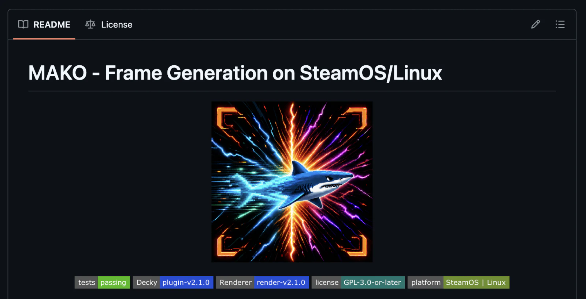
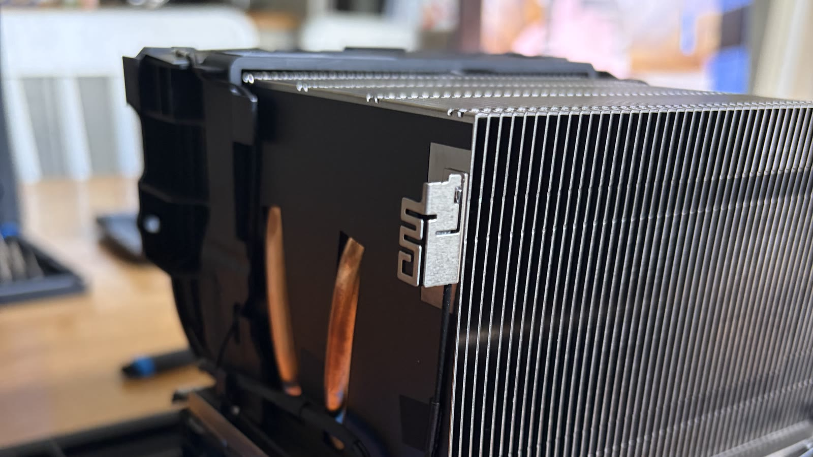
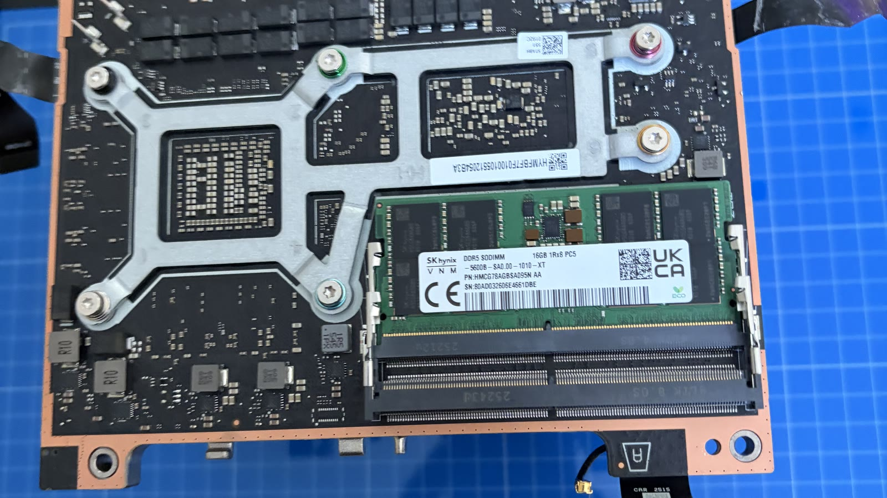
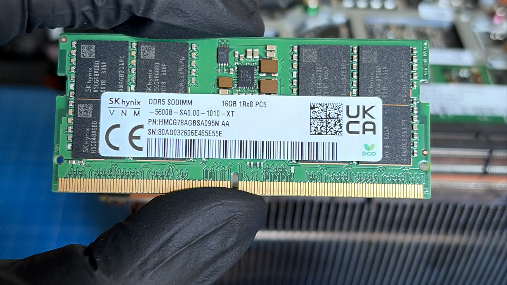
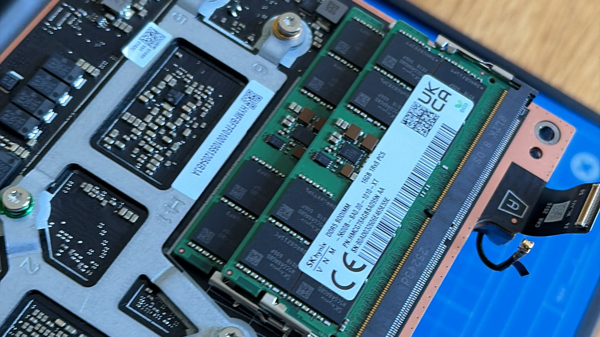
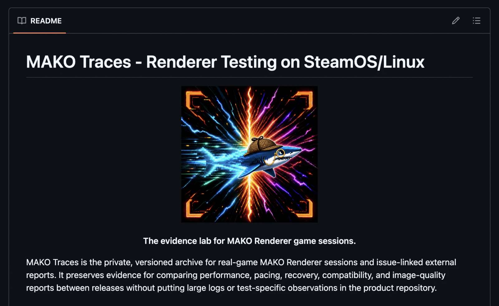

Frame generation works by using an AI model to compare two real frames a game has rendered, estimate how the picture changed between them, and create another frame that belongs in the gap. It is not inventing a new game scene; it is estimating the in-between motion. The game keeps producing its normal frames, but the display has more motion to show, so movement can look smoother. That is the basic idea.

It is also easy to underestimate. The extra images come from a model that has to be accurate enough to follow fast, complex movement without leaving ghosting, doubled objects or warped interface elements behind. At the same time, it has to be light enough to finish on the graphics hardware before the next real frame is needed. If it arrives late, it adds latency. If it asks too much of the GPU, it slows down the real game frames it was supposed to help. If the game opens a menu, shows an overlay or changes speed, the system has to notice before smoothness becomes stutter.

What intrigued me was the gap between what I could see on Windows and what I could find on Linux. I tried the existing Linux tools, saw how much potential they had, and started wondering whether I could build improvements on top of them. To me, the Linux scene did not yet feel up to speed: fixed settings could create extra frames, but that was only part of the problem. They also had to survive Proton, Gamescope, overlays, Flatpak sandboxes and different displays, while staying out of the way when the GPU was under pressure. A high frame count is not enough if generated frames disrupt pacing, delay input or make the real game frames wait. I wanted the system to make better decisions for the game and hardware in front of it. Sometimes that means generating extra frames. Sometimes it means generating fewer. Sometimes the smartest decision is to leave the real frame alone and recover cleanly.

The result is [MAKO](https://github.com/eugeniosegala/MAKO), an open-source frame-generation system for SteamOS and Linux. MAKO Renderer does the graphics work and decides how to schedule it, while MAKO Decky makes it practical to install and control from Gaming Mode. Its main contribution is the introduction of Adaptive Frame Generation. A fixed configuration makes a blunt choice, such as 2x or 3x frame generation. Adaptive can work in between those settings: it aims for a chosen target and generates only the amount of extra work that is useful at that moment. That can avoid spending GPU time on frames the display does not need, reduce the risk of unnecessary input latency and find a better trade-off between smoothness and responsiveness for the game in front of it. It is the foundation for the performance, recovery and compatibility work that follows, and the moment the project began moving in the direction I had foreseen.

This is how that idea grew from an experimental plugin into a much larger system, and why developing it eventually required a Mac, a modified Steam machine, frontier AI agents and a private laboratory of real-game traces.

## How MAKO began

MAKO did not begin from a blank file. [Lossless Scaling](https://store.steampowered.com/app/993090/Lossless_Scaling/) made engine-external frame generation practical on Windows. [PancakeTAS and the lsfg-vk contributors](https://github.com/PancakeTAS/lsfg-vk) did the remarkable work of running its model through a Vulkan layer on Linux, and [xXJSONDeruloXx created the original Decky LSFG-VK plugin](https://github.com/xXJSONDeruloXx/decky-lsfg-vk), which gave people a practical way to install, configure and use it directly from SteamOS Gaming Mode. I started from those open-source foundations, retained their attribution and used my own licensed Lossless Scaling model files.

At the end of July 2026, I forked the original Decky LSFG-VK plugin and migrated it to an in-development lsfg-vk branch, making a few changes of my own along the way. That updated lsfg-vk fork already showed encouraging improvements in how it behaved and in performance. It was not a finished answer, but it was enough to convince me that Linux frame generation had a much more interesting direction to explore.

Then the real problems appeared. The Decky LSFG-VK plugin could configure the lsfg-vk layer, but it could not fix presentation stalls, a generated image that took too long to arrive, or a game that changed its rhythm halfway through a session. In early August I began expanding that lsfg-vk fork below the plugin interface, and realised that the hard part was not installation. It was orchestration.

On 10 August I added the [first Adaptive Frame Generation implementation](https://github.com/eugeniosegala/lsfg-vk-experimental/commit/00ca69e07e101e7e8265d4222935565de8aff1d5), allowing the layer to vary generated work towards a target instead of blindly applying one multiplier. Two days later, the policy had grown complicated enough to become a [deterministic Adaptive scheduler](https://github.com/eugeniosegala/lsfg-vk-experimental/commit/93323a4408fbbfd4ae32a69ee96149b1df94611d): the Vulkan layer observes what is happening, but the mathematical decision can be replayed and tested away from the GPU.

As the work grew, I decided to bring the two experiments together in one repository and give the project a name: MAKO, short for Motion-Adaptive Kernel Orchestration. From that point, I called the Vulkan layer MAKO Renderer and the SteamOS interface MAKO Decky. Before that, they were the Decky LSFG-VK plugin and an experimental lsfg-vk fork. I then treated the two MAKO components, packaging, diagnostics and tests as one system with clear boundaries.

_The public MAKO repository, home to MAKO Renderer and MAKO Decky._

## Why the project needed a real machine

I can replay timing sequences, run sanitizers and validate configuration contracts on my Mac. Those checks tell me whether the logic is consistent. They cannot tell me what a real AMD GPU, the Vulkan loader, Gamescope, a Flatpak game and a physical display will do together.

Docker is valuable for repeatable builds and automated checks, but it shares the host kernel and graphics environment. It does not recreate the exact SteamOS session, AMD driver, Gamescope compositor, display connection and presentation timing that MAKO Renderer has to live with. A virtual machine adds another problem: unless it has carefully configured GPU passthrough, the game sees a virtual graphics device rather than the AMD hardware I am trying to support. Even with passthrough, it is still not the same end-to-end system a SteamOS player uses.

That distinction matters because frame generation operates at the awkward boundary between the game, Vulkan, the compositor and the display. A problem can be completely invisible in a unit test, then appear only when real frames arrive with an unexpected cadence, Gamescope changes the presentation path or a Flatpak launch environment alters what the game can see. The questions I needed to answer were not only whether the code ran, but whether it recovered cleanly, preserved responsiveness and behaved correctly on the machine it was built for.

I therefore turned a Steam machine into a dedicated bare-metal development worker. My Mac is the control station; the Steam machine is where the hardware truth lives. It builds MAKO, runs the game and gives the agents something real to investigate instead of a simulation of the problem.

_The dedicated SteamOS and AMD machine opened on the workbench before it became MAKO's bare-metal development worker._

The machine became a workstation rather than simply a console. The storage upgrade made room for build outputs and game captures. I then expanded the memory from one 16 GB DDR5 SODIMM to two matching modules, for 32 GB in total and dual-channel memory bandwidth. One module is enough to build and test MAKO; it does not prevent the CPU from compiling in parallel. The real benefits of the upgrade are more room for the tools and artefacts needed in one development session, plus more memory bandwidth for this AMD system's shared CPU and graphics workloads.

_The original single-module memory configuration before the upgrade._

_The matching DDR5 module used for the upgrade._

_Both modules installed, giving the SteamOS worker multi-channel memory._

When I need release-grade evidence, the machine becomes a temporary one-job CI runner. It takes a clean copy of the exact branch, builds MAKO Renderer and MAKO Decky, checks image quality on the AMD GPU, verifies native and Flatpak packages and proves that MAKO Renderer's Vulkan layer activates. Then the runner, credentials, checkout and temporary build state are removed. The hardware is permanent; the test environment is not.

In practice, the physical machine remains, but the software state does not. Each release check starts from a clean copy of the branch with temporary build, installation and credentials state, then removes that state when it is finished. A pass therefore means the current version works on real hardware, rather than that an old plugin, cached build or forgotten library happened to hide a problem.

## The agent loop and MAKO Traces

In [Event-Driven Development for AI Agents](/event-driven-development-for-ai-agents/), I described how I stopped constantly explaining bugs to agents and started feeding them deterministic events. MAKO is the physical version of that idea. I use a hive architecture in which agents can inspect the scheduler, analyse a trace, review a Vulkan boundary, work on the MAKO Decky interface, run deterministic tests or prepare a focused hardware experiment.

I define the behaviour, constraints and evidence I will accept. Agents explore or change the system. Deterministic tests grade the policy. The SteamOS machine tests the physical boundary. A real game session produces timing and recovery events, and those events become input to the next investigation. The output of one agent is not the end of the task; it is evidence for the next one.

Some controlled sessions are also automated as replays. The SteamOS worker runs a known scenario again with a specific build and configuration, collects the session diagnostics and then produces a trace bundle for that exact time window. This does not make every game perfectly scriptable. It makes a known problem repeatable enough for an agent to compare the new behaviour with an earlier run, rather than relying on a vague memory of a play session.

As MAKO became more capable, manual testing stopped being enough. I could play a game, read a log, make a change and test it again, but the evidence was scattered between old checkouts, terminal output and what I could remember. It became too easy to lose the exact relationship between a version, a game, a hardware configuration and the result.

I created a private repository called MAKO Traces to turn those individual tests into a growing evidence archive. It keeps the logs and context for each version so I can compare the same scenario across releases, games and hardware, instead of treating each session as an isolated anecdote. The archive grows from my own controlled sessions, automated replays and carefully separated reports from players.

_MAKO Traces, the private evidence laboratory for real-game MAKO Renderer sessions on SteamOS and Linux._

Every controlled session, whether run manually or captured after an automated replay, is a versioned bundle: source identity, hardware and runtime metadata, active MAKO Renderer configuration, presentation diagnostics, a compact event index, optional time-clipped Steam and MAKO Decky logs, my notes and a checksum for every file. The raw evidence is immutable. If my interpretation changes, I can update the notes, but I cannot quietly rewrite the history.

MAKO does not silently collect telemetry. When selected testers deliberately provide diagnostics, I keep those reports in a separate area of the archive, with their context and uncertainty intact. They are valuable evidence about the diversity of real machines and games, but they do not pretend to be controlled benchmarks. That distinction lets the archive grow without losing track of what each piece of evidence can actually prove.

## Using AI on the difficult part

For the hardest MAKO work, I used [GPT-5.6 Sol in Codex](https://developers.openai.com/api/docs/models/gpt-5.6-sol), generally at maximum reasoning and often through Codex Ultra, on the ChatGPT Pro subscription that costs me roughly £200 per month. I was not using it for ordinary coding or to "vibe code" the project into existence. I was using it to explore scheduling ideas, attack those ideas with adversarial timing sequences, and help turn the survivors into deterministic tests.

_A snapshot of Codex usage on 21 August, while the Codex agent worked through scheduling problems in isolation, searching for algorithmic breakthroughs before the results returned to tests and real hardware._

The best example is MAKO's Fractional Adaptive placement clock. Imagine a game producing 60 real frames per second on a 90 Hz display. A fixed 2x setting tries to produce 120 frames, which is more than the display needs. A simplistic system can alternate its generated work, but it may place that work on the wrong interval, worsen spacing or create a catch-up burst later.

The scheduler separates the amount of work from where it is placed. It calculates how much generated work has been earned, then chooses the least disruptive place to show it. It cannot invent extra frames, exceed the selected limit or make spacing worse. If a generated frame cannot be placed safely, it disappears rather than becoming a burst. The same approach helped MAKO recognise genuine cadence changes, recover from blocked generated images, rebuild its temporal history and shed work when a heavy scene cannot afford the requested multiplier.

The model helped with the reasoning, but it did not get to declare success. Every useful idea became an invariant, a replayable sequence and, where it mattered, a real hardware experiment. The hot path also had to stay cheap: no normal per-frame heap allocations for generated-frame plans, fewer redundant copies and uploads, and native presentation still available when generated work fails.

OpenAI recently published [ten advances in mathematics and theoretical computer science](https://openai.com/index/ten-advances-in-mathematics/) produced with an internal model. A frame scheduler is not a long-standing conjecture, but the relevance is real. Good frame pacing is a difficult mathematical problem: a moving sequence of constraints that has to remain stable while the game, the display and the available GPU time keep changing. Models are becoming good enough to explore that space and surface timing policies a person might not have considered. But a policy that looks perfect on paper can still create ghosting, latency or a missed real frame. MAKO gives every proposal a hard test: replay it, run it under GPU pressure and compare the result on real hardware. That is where model reasoning becomes engineering.

## Beyond frame generation

Adaptive Frame Generation is the beginning of MAKO's roadmap, not the end of it. [Scaling is the next planned capability](https://github.com/eugeniosegala/MAKO#what-mako-is). It poses a closely related question: not just how to place another frame between two real ones, but how to preserve a convincing image while spending less of the hardware budget. The same trace workflow can compare that work across games, resolutions and devices, rather than leaving every new feature to a collection of isolated impressions.

HDR is an even more demanding frontier. MAKO Renderer already contains groundwork for HDR10/PQ, linear scRGB, colour conversion and Gamescope feedback, but HDR frame generation is not supported in a release today. A safe implementation has to establish that the game actually chose HDR, not merely that the display supports it; preserve the right colour interpretation and metadata; and use the correct Gamescope and Vulkan layer path. When any of that evidence is missing, real frames must continue untouched. The [HDR architecture](https://github.com/eugeniosegala/MAKO/blob/main/engine/docs/HDR-PIPELINE.md) is deliberately designed around that fail-closed principle.

This is where the data-driven AI workflow becomes especially powerful. Given versioned controlled traces and consented player reports, an agent can correlate colour formats, HDR metadata, presentation events and visual symptoms with the exact Proton, DXVK or VKD3D-Proton version, game, hardware and layer configuration involved. It can search the compatibility matrix for patterns, propose a narrowly scoped workaround and design the test that could disprove it. It should not silently enable a global fix. Every rule still needs a reproducible trace, a known safe fallback and evidence on the real SteamOS machine. Over time, that turns compatibility from a list of anecdotes into an engineering knowledge base.

## Was this attempted before?

Before calling any of this a first, I looked for the work that came before and for projects solving nearby versions of the same problem. MAKO is not the first frame-generation system on Linux. Proton 9.0-4 [added support for NVIDIA's Optical Flow API and DLSS 3 Frame Generation](https://github.com/ValveSoftware/Proton/wiki/Changelog), allowing supported games and hardware to use an engine-integrated Windows feature through Proton. [OptiScaler](https://github.com/optiscaler/OptiScaler), Decky Framegen and lsfg-vk provide other routes.

The important distinction is the architecture. The [lsfg-vk configuration documentation](https://github.com/PancakeTAS/lsfg-vk/blob/develop/docs/Configuration.md) describes fixed multipliers and no pacing modes beyond the VSync/FIFO workaround, while its [Gamescope notes](https://github.com/PancakeTAS/lsfg-vk/wiki/Gamescope-Compatibility) document the rough pacing that can appear when output and display refresh do not align. Windows has even closer precedents: Lossless Scaling introduced [Adaptive Frame Generation](https://store.steampowered.com/news/app/993090/view/518581441632666732), and NVIDIA documents [Dynamic Multi Frame Generation](https://github.com/NVIDIA-RTX/Streamline/blob/main/docs/ProgrammingGuideDLSS_G.md) for explicit D3D12 renderer integration.

After reviewing the public repositories and documentation I could find, I found no earlier public Linux or SteamOS implementation that combines engine-external Vulkan interception, target-FPS adaptive multi-frame scheduling, Gamescope recovery, dynamic cadence detection, load shedding, deterministic validation and a trace-backed real-hardware loop. I cannot prove that nobody attempted it privately. The narrower claim is that MAKO appears to be the first publicly documented open-source Linux/SteamOS implementation of this specific adaptive Vulkan-layer architecture.

## Final thoughts

The experimental plugin was downloaded more than 20,000 times in less than one week, and MAKO's [Featured In](https://github.com/eugeniosegala/MAKO/blob/main/plugin/docs/FEATURED_IN.md) archive now contains 45 videos from creators testing it across Steam Deck, SteamOS and other handhelds. The discussion spread through [r/SteamDeck](https://www.reddit.com/r/SteamDeck/comments/1vrox2x/mako_frame_generation_and_more_on_steam_os/), [r/OneXPlayer](https://www.reddit.com/r/OneXPlayer/comments/1vvd51i/mako_adaptive_frame_gen_setup_guide_more_fps_and/) and [r/SteamDeckUnlocked](https://www.reddit.com/r/SteamDeckUnlocked/comments/1vt99ga/new_form_of_framegenration_for_the_steam_deck/). Praise and criticism both matter, but neither replaces evidence from a specific game, device and configuration.

AI did not remove me from the important loop. I still set the architecture, performance budgets, compatibility boundaries and trade-offs, decide which measurements are trustworthy, review the changes and reject results that are not good enough. An agent can optimise a scheduler, but it cannot decide whether one extra frame is worth more latency, more ghosting or less battery life for the person holding the device.

Still, watching a model reason through a difficult, evolving pacing problem feels like an early glimpse of the singularity. Not in the science-fiction sense that the human suddenly disappears, but in the sense that a new kind of problem-solving capacity is becoming visible. We are only beginning to understand which complicated problems these models can meaningfully help solve, and MAKO made that feel much less theoretical to me.

The most interesting thing I built is therefore not only a frame-generation plugin. It is the development system around it: a Mac, a modified SteamOS machine, frontier models, deterministic tests, selected diagnostics and a private evidence archive working as one engineering loop. MAKO is a new point in an existing lineage, not a claim that nothing came before it, and that is exactly why I am comfortable showing the work, the constraints and the evidence behind it.

You can explore MAKO, its testing architecture and its AI-use policy at [github.com/eugeniosegala/MAKO](https://github.com/eugeniosegala/MAKO).
