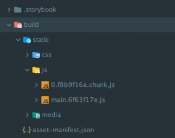
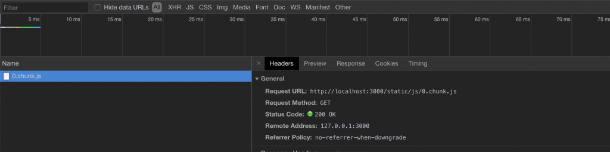

Quando mi sono avvicinato per la prima volta alle **applicazioni lato client** mi è venuto spontaneo pormi alcune
domande sulle performance.

Molti sviluppatori che producono i template **front-end** server side non si preoccupano più di tanto di questo aspetto,
in quanto il server elabora le pagine molto più velocemente del client e molto spesso applicazioni di questo tipo
sono **MPA (Multi Page Application)**.

In un contesto client e per di più **SPA (Single Page Application)** la musica cambia abbastanza rapidamente.

> Il miglior modo per creare un’applicazione rapida ed efficiente è pensare che il client sia vostro nemico, giocherà sempre contro di voi a causa delle “limitate” risorse che offre.

Prendiamo ora un caso di esempio basato su **React**, immaginiamo dunque di avere una web app client side, contenente un
componente che verrà restituito tramite una condizione logia (ad esempio la modifica di uno **State**). **Il risultato
finale potrebbe essere:**

```jsx
render() {
  const { ConditionalRender } = this.state;
  return (
    <div className="App">
      <header className="App-header">
        
        <h1 className="App-title">Welcome to React</h1>
      </header>
      {ConditionalRender &&
        <MyAwesomeComponent />
      }
    </div>
  );
}
```

`MyAwesomeComponent` in questo caso verrà incluso nel Bundle di **WebPack** (se avete utilizzato ad esempio il **React
Create App**) anche se in realtà l’utente potrebbe non visualizzarlo mai, considerato che lo State `ConditionalRender`
potrebbe non essere modificato. In questo specifico caso il risparmio sarà di qualche kilobyte, ma in applicazioni più
grandi, obbligheremo l’utente a scaricare anche elementi che effettivamente non sono presenti nella view attuale,
aumentando così sempre di più il **page load**.

Quello che possiamo fare per recuperare terreno è utilizzare i `Dynamic import`.

L’idea di base è suddividere i componenti che non vogliamo che vengano caricati nel bundle principale in vari **chunks** (pezzi). 
Sarà quindi necessario sviluppare un componente **HOC** (Higher-Order Components) per effettuare le
chiamate ai vari componenti esterni al pacchetto:

```jsx
// Async Component from Maximilian Schwarzmüller
import React, { Component } from 'react';

const asyncComponent = (importComponent) => {

  return class extends Component {
    state = {
      component: null,
    };

    componentDidMount() {
      importComponent()
        .then(cmp => {
          this.setState({ component: cmp.default });
        });
    }

    render() {
      const Chunk = this.state.component;
      return Chunk ? <Chunk {...this.props} /> : null;
    }
  };
};

export default asyncComponent;
```

Questo componente HOC andrà in realtà a chiamare il componente reale attraverso una `.then()`.

Quando andremo ad importare il nostro componente il codice potrebbe essere:

```jsx
const MyAwesomeComponent = asyncComponent(() => import('./components/MyAwesomeComponent'));

// some code

render() {
  const { ConditionalRender } = this.state;
  return (
    <div className="App">
      <header className="App-header">
        
        <h1 className="App-title">Welcome to React</h1>
      </header>
      {ConditionalRender &&
        <MyAwesomeComponent />
      }
    </div>
  );
}
```

E’ possibile notare come `MyAwesomeComponent` viene importato dentro una funzione come se fosse un argomento. In fase
di **production build** WebPack creerà un file chunk grazie al nested import del nostro componente:

`() => import('./components/MyAwesomeComponent')`

Questa tecnica può essere utilizzata anche all’interno delle **rotte**, nel caso di `react-router-dom` ad esempio, sarà
sufficiente passare la costante `MyAwesomeComponent` all’interno della `Route` in questo modo:

`<Route path="/example" component={MyAwesomeComponent} />`

Ora, una volta lanciato il comando **yarn build** o **npm run build** a seconda del manager che utilizzate, potrete
vedere il vostro file chunk nella cartella di build.



Se aprite la vostra **configurazione WebPack di production** è possibile vedere la porzione di codice che crea i nostri
file chunk:

```jsx
output: {
  // The build folder.
  path: paths.appBuild,
    // Generated JS file names (with nested folders).
    // There will be one main bundle, and one file per asynchronous chunk.
    // We don't currently advertise code splitting but Webpack supports it.
    filename: 'static/js/[name].[chunkhash:8].js',
    chunkFilename: 'static/js/[name].[chunkhash:8].chunk.js',
    // We inferred the "public path" (such as / or /my-project) from homepage.
    publicPath: publicPath,
    // Point sourcemap entries to original disk location (format as URL on Windows)
    devtoolModuleFilenameTemplate: info =>
    path
      .relative(paths.appSrc, info.absoluteResourcePath)
      .replace(/\\/g, '/'),
},
```

Lanciando ora la vostra applicazione, noterete che all’interno del network verrà effettuata una chiamata quando lo state
della vostra applicazione verrà modificato.



Grazie a questa tecnica ottimizzeremo la nostra applicazione diminuendo la dimensione del bundle e fornendo all’utente
solamente quello che sta realmente visualizzando.

**Nella versione di React 16.6, è possibile “splittare” la tua applicazione grazie ad una nuova e semplice funzionalità!
Ti consiglio di leggere il mio articolo in merito: [Come fare Code Splitting con React e Suspense](/come-fare-code-splitting-con-react-e-suspense/)**

**E’ importante sapere che:** suddividere tutta l’applicazione in chunk è controproducente in quando obbligheremo
l’utente a effettuare chiamate ad altri file senza motivo. L’applicativo sarà più piccolo in termini di dimensione, ma
più lento in termini di caricamento a causa della risposta.
