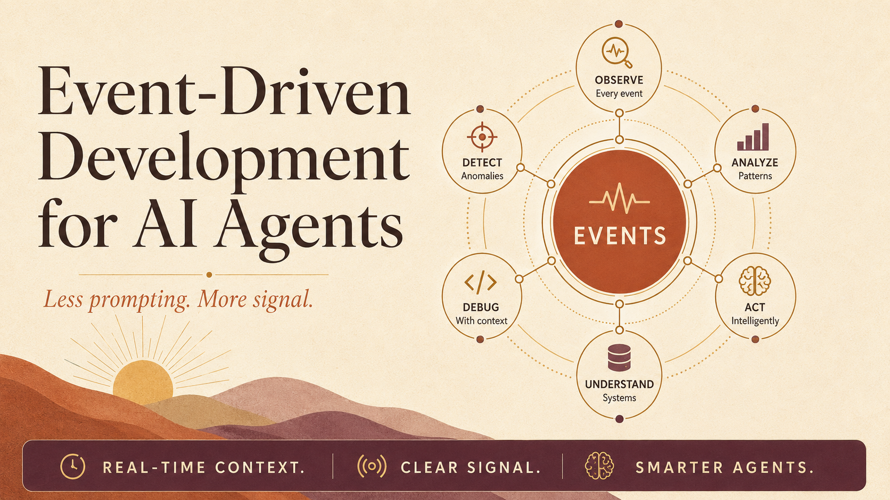
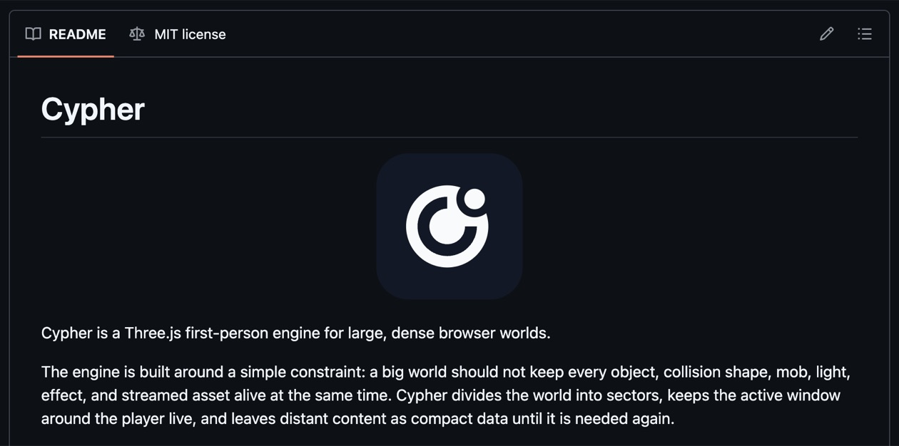
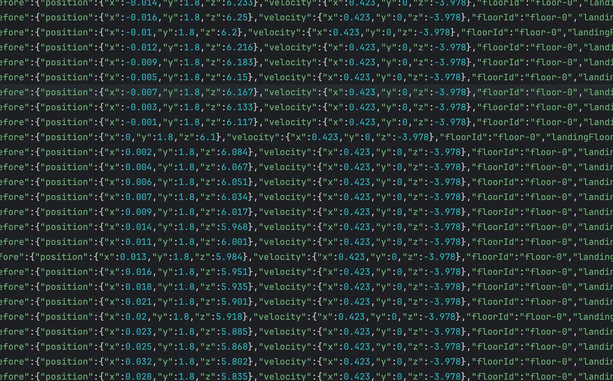
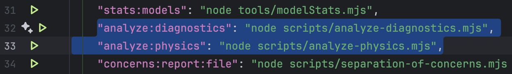
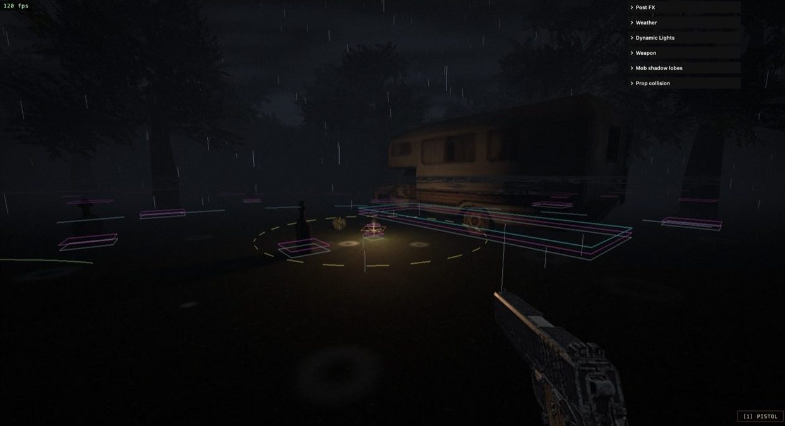

I'm moving further and further away from prompting Claude Code/Codex to solve problems. Instead, I base most of my interaction with agents on deterministic events.

I don't write a lot of prompts. I write generators of events.

I let models interact with a series of raw metrics (events) that describe how my application behaves, so I don't have to. And I've discovered they often perform better reading long, verbose sequences of events to work out what's wrong and what to do next (counter-intuitive as that sounds) than being constantly prompted with "fix X, fix Y" and so on...

Deterministic events driven by maths are better than I am at prompting the agents, and anyway, constantly prompting agents is arguably a very boring job.

## Meet Cypher

I'll explain this flow a bit better using my most ambitious project so far as an example: **Cypher**.

Cypher is a 3D graphics engine I've developed that runs in a browser.

_The README for Cypher, my Three.js first-person engine for large, dense browser worlds._

It's a very complex project, as I decided to use only one dependency (**Three.js**), which is a renderer, and built everything else in vanilla JavaScript, including:

- Collisions
- Physics
- Sector streaming
- Mob AI
- FX effects
- And basically everything else that makes an engine a real engine.

I based my work on the Quake engine and UT99 (but I'm just one person).

The engine is fairly large in terms of files and logic, and it's something that requires a substantial amount of testing and iteration to develop properly. This is exactly why most game developers tend to use an existing engine (such as Unity), because building one from scratch is usually considered a massive endeavour, especially in 3D graphics.

I'm naturally drawn to complex problems, so I created Cypher as a highly advanced graphics engine running on a platform with extreme constraints and adversities towards 3D graphics and physics: a web browser.

Web browsers are notoriously poorly optimised for video games. They come with a series of peculiarities designed to help render websites, but those same peculiarities fight against graphics engines the whole time.

Long story short: building games in browsers is a nightmare. The environment isn't designed for them, there are a lot of limitations, and the space is generally very immature with a lack of support on all sides. A disaster, basically.

Perfect, then. I enjoy hard problems, so this is what I should work on next.

## Running into 3D physics problems

Now let's explore the idea of **event-driven development for AI agents**.

I've built engines in the past (with no use of AI), but it was mostly 2.5D, and had pretty much most of the features the Doom engine had. It was relatively complicated to write from scratch, but it was still achievable for my level of understanding of computer graphics.

However, when I started developing my new custom 3D engine (Cypher), I ran into a series of complex problems involving realistic and accurate physics in a 3D world. To give you a glimpse, gravity and object collisions weren't as accurate as I wanted them to be, and they were causing effects such as "clipping" or "snapping" alongside other typical problems in that domain.

_Example of a problem called "Clipping", where you can literally clip into walls/stairs._

## How most people debug with an agent

How would you typically solve this problem while working with **Claude Code**?

I'm guessing you'd try to ask the agent:

> Every time I descend the stairs diagonally in my video game, I often clip with the edges of the stairs. Help me debug the problem, the main logic is in `@physics.mjs` etc...

That's pretty much how people tend to vibe code applications in general (or simply ask agents to help them). You see that across more traditional web applications too, and not only games, like APIs and websites. You write some code, something goes wrong, you ask the AI to fix it or help you, and you continue down this loop until you're satisfied with the fix.

## Why words don't work

This doesn't work well, because your own words are actually a lossy version of the problem you think you're experiencing. Problems are often more complicated than they seem.

This is why I often felt agents weren't helping me much and were only introducing new bugs in some cases.

I don't think using words to explain maths is a good idea. And the thing is, most problems in software are mathematical problems.

Even writing CSS has more to do with maths than you realise.

So... words are a low-resolution tool for a high-resolution problem.

## Building an event recording system

What if we change approach completely? That's what I did.

The first thing I did was create an accurate diagnostic tool that collects everything I do:

- Player location
- Nearby objects
- Collisions
- Distances between me and entities
- Physics
- And so much more...

_Some of the logs being registered while I interact with my game._

The diagnostic module I built is baked into everything I do.

It's a dev-only data recorder that keeps track of all the events moving across my engine at a very granular level.

I also have ways to record "short events" to reduce the noise of the main logs while playing (I've basically configured shortcuts to do so).

_The diagnostic logs, split into separate JSONL files per concern (frame spikes, geometry allocation, mob AI, playstyle, and so on)._

I also built commands that the agent can use as a tool to analyse the events more efficiently. This is useful, and the agent will try to explore the data as it pleases.

_Those are basically NPM commands that accept arguments for filtering._

As a cherry on top, I built a bunch of spatial overlays that help me record and collect metrics.

_Overlays are helpful for you and the models too, as screenshots can further improve the model's understanding of problems alongside the data._

You can see where this is going. I have a very rich, detailed sub system that collects metrics for me, and there's an exorbitant amount of them. In some extreme cases I've collected 500k tokens of metrics, so models with large context windows (Opus 4.8) let you process more data.

Conceptually, this mechanism can be used for any application if you think about it.

When you start your next project (or even an existing one), try building this event recording system. It's the key to unlocking the full potential of LLMs in my opinion.

## Letting the model find anomalies

So now what? I ended up with a pile of raw physics metrics, seemingly useless and unreadable to humans. But surprisingly to me, the model is incredibly good at making sense of it!

To improve my game, I'd simply play, then ask the model to check the raw metrics.

From there (and for my use-case), Claude Code would automatically spot physics anomalies in the code, flag them, and fix them.

You might be wondering how that's possible. How can the agent identify these issues without me specifying the problem? Well, the thing is, there are many things in physics that are known to be true. For instance, a sudden jump along the XYZ axes that describes an impossible movement. There are a lot of anomalies in physics that the model already has its own internal understanding of.

## Removing myself from the loop

Up to this point I'm still doing one thing by hand: telling the agent to go and read the metrics. The next step is to remove even that.

Claude Code lets you run hooks at specific moments in the agent's lifecycle. The one I care about most fires when the agent finishes a turn (a `Stop` hook). I use that moment to do two things automatically: hand the agent the latest batch of metrics from my play session, and tell it to keep going while there are still anomalies worth investigating.

So the loop runs itself. The agent fixes something, the hook feeds it the next slice of data, and it carries on. No "now check the collisions", no "look at the frame spikes", no me sitting there prompting turn after turn. The hook is doing the prompting for me, and it does it based on the data rather than on whatever I happen to remember to ask about.

My role collapses down to playing the game and generating events. The hook keeps the agent chewing through the diagnostics until there's nothing left worth flagging.

To be clear, this doesn't mean I've handed over the steering wheel. Taste, direction, and architecture are still entirely on me. The loop is great at closing the gap between "this is wrong" and "this is fixed", but it has no opinion on what the engine should become, how the systems should be structured, or which trade-offs are worth making. Those decisions don't show up in the metrics, and they're exactly where I want to be spending my attention. What I'm offloading is the tedious part (the constant prompting to chase down anomalies), not the thinking.

## It works beyond games

The same goes well beyond games. Anomaly detection through logs generalises to all sorts of systems, and here are a few places I think it fits naturally:

- **APIs and backends**: response times creeping up, an endpoint returning 500s under load, a query that suddenly scans far more rows than it should.
- **Frontend and UX**: layout shifts, components re-rendering far more than they need to, users dropping off at the same step in a flow.
- **Data pipelines**: row counts that don't reconcile between stages, schema drift, jobs that finish "successfully" but produce empty or duplicated output.
- **E-commerce and checkout**: carts that fail silently, payment attempts that stall, conversion dropping after a deploy.
- **Infrastructure and queues**: memory climbing until a service restarts, error rates spiking after a release, tasks that get stuck or fall behind and never catch up.

In every case the pattern is identical: the system is already emitting signals about what's going wrong, you just need to record them verbosely and let the agent read them. None of these are physics, but they all have a notion of "this shouldn't be happening", and that's all the agent needs to start digging.

One thing matters more than anything else here: this is not traditional logging. Normal logs are written for a human reading them after the fact, so they're sparse by design. The agent loop wants the opposite. The logs I feed it are deliberately, almost absurdly verbose, capturing the full state around every event (positions, velocities, timings, inputs, expected versus actual) frame by frame. Traditional logging asks "what is the least I need to record?"; this asks "what is the most I can capture without affecting the behaviour I'm measuring?". Where a human would drown, the agent thrives, holding thousands of lines in context to spot the single frame where a value did something it shouldn't. If your logs are readable at a glance, they're almost certainly not detailed enough for this.

It isn't only for fixing what's broken, either. I use the same loop to build new features from scratch. To add a new mob, instead of writing a long prompt I define what "correct" looks like as events: keep a certain distance from the player, lose track of me when I break line of sight, give up after chasing too long, never walk through a wall. The agent makes an attempt, the hook feeds back the events it produced, and the gap between what the logs show and what I declared correct becomes the next thing to close. The feature is done when the events line up with the behaviour I specified, so the diagnostics double as an executable definition of the feature itself.

That points at how I define "success", and in practice I lean on two complementary kinds. The first is loose and declarative: a file like an `Agent.md` or `Claude.md` describing in plain prose what the app should do and what "good" looks like (your performance budget, the flows that matter). The collector lets the agent compare reality against that description and flag discrepancies. It's fuzzy on purpose, and it's great for direction.

The second is the part people skip: deterministic checks. These are hard, machine-evaluated assertions over the event stream, with no room for interpretation. In Cypher that's rules like "the player's feet must never drop below the floor", "frame time must stay under 16ms", or "position must never change by more than its velocity allows in a tick". On a backend it's "p99 latency under 200ms" or "row counts reconcile between stages". Each is just maths over events I'm already recording, so it returns a clean pass or fail. The agent can rationalise its way around a vague prompt, but it cannot argue with a failing assertion.

The two work together: the soft goals tell the agent where to head, the deterministic checks tell it what it isn't allowed to break on the way. Direction plus guardrails. And this is where the loop closes, because those checks are exactly what the hook runs at every turn before letting things continue. If one fails, that failure goes straight back as the next thing to fix. The agent isn't just fed verbose data automatically, its work is graded against hard criteria automatically, and that's why I trust the loop to run without me hovering over every turn.

## Final thoughts

This article is more of an intro to a concept I'm finding more and more useful.

I'm not saying I write 0 prompts, because of course you need to set some direction. What I'm saying is that the number of prompts and the amount of information I give are dropping significantly.

My engine is not open-source yet, as it became so advanced that I see a commercial angle to it.

However, if you find this concept interesting, I'll cover the implementation details in a follow-up article: the hooks, the recording systems, and so on.

If you simply want to see the engine in action, you can check it out here: https://effervescent-paprenjak-493178.netlify.app/
