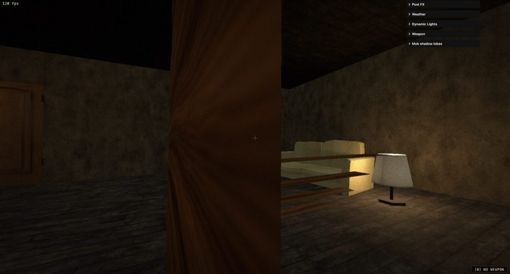
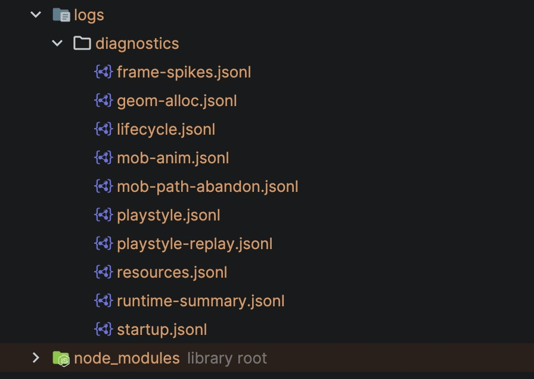

I'm moving further and further away from prompting Claude Code/Codex to solve problems. Instead, I base most of my interaction with Agents using deterministic events.

I don't write a lot of prompts. I write generators of events.

I let models interact with a series of raw metrics (events) that describe the behaviour of my application for me, so I don't have to.

I've discovered that models often perform better when looking at long, verbose sequences of events to work out what's wrong and what to do next (which is counter-intuitive for most), instead of me constantly prompting them with "fix X, fix Y" and so on...

Deterministic events driven by maths are better than I am at prompting the Agents, and anyway, constantly prompting agents is arguably a very boring job.

## Meet Cypher

I'll explain this flow a bit better using my most ambitious project so far as an example: **Cypher**.

Cypher is a 3D graphics engine I've developed that runs in a browser.

It's a very complex project, as I decided to use only one dependency (**Three.js**), which is a renderer, and built everything else in vanilla JavaScript, including:

- Collisions
- Physics
- Sector streaming
- Mob AI
- FX effects
- And basically everything else that makes an engine a real engine.

I based my work on the Quake engine and UT99 (but I'm just one person).

The engine is fairly large in terms of files and logic, and it's something that requires a substantial amount of testing and iteration to develop properly. This is exactly why most game developers tend to use an existing engine (such as Unity), because building one from scratch is usually considered a massive endeavour, especially in 3D graphics.

I'm naturally drawn to complex problems, so I created Cypher as a highly advanced graphics engine running on a platform with extreme constraints and adversities towards 3D graphics and physics: a web browser.

Web browsers are notoriously poorly optimised for video games. They come with a series of peculiarities designed to help render websites, but those same peculiarities fight against graphics engines the whole time.

Long story short: building games in browsers is a nightmare. The environment isn't designed for them, there are a lot of limitations, and the space is generally very immature with a lack of support on all sides. A disaster, basically.

Perfect, then. I enjoy hard problems, so this is what I should work on next.

## Running into 3D physics problems

Now let's explore the idea of **event-driven development**.

I've built engines in the past (with no use of AI), but it was mostly 2.5D, and had pretty much most of the features the Doom engine had. It was relatively complicated to write from scratch, but it was still achievable for my level of understanding of computer graphics.

However, when I started developing my new custom 3D engine (Cypher), I ran into a series of complex problems involving realistic and accurate physics in a 3D world. To give you a glimpse, gravity and object collisions weren't as accurate as I wanted them to be, and they were causing effects such as "clipping" or "snapping" alongside other typical problems in that domain.

_Example of a problem called "Clipping", where you can literally clip into walls/stairs._

## How most people debug with an Agent

How would you typically solve this problem while working with **Claude Code**?

I'm guessing you'd try to ask the Agent:

> Every time I descend the stairs diagonally in my video game, I often clip with the edges of the stairs. Help me debug the problem, the main logic is in `@physics.mjs` etc...

That's pretty much how people tend to vibe code applications in general (or simply ask Agents to help them). You see that across more traditional web applications too, and not only games, like APIs and websites. You write some code, something goes wrong, you ask the AI to fix it or help you, and you continue down this loop until you're satisfied with the fix.

## Why words don't work

This doesn't work well, because your own words are actually a lossy version of the problem you think you're experiencing. Problems are often more complicated than they seem.

This is why I often felt Agents weren't helping me much and were only introducing new bugs in some cases.

I don't think using words to explain maths is a good idea. And the thing is, most problems in software are mathematical problems.

Even writing CSS has more to do with maths than you realise.

So... using words is bad.

## Building an event recording system

What if we change approach completely? That's what I did.

The first thing I did was create an accurate diagnostic tool that collects everything I do:

- Player location
- Nearby objects
- Collisions
- Distances between me and entities
- Physics
- And so much more...

_Some of the logs being registered while I interact with my game._

The diagnostic module I built is baked into everything I do.

It's a dev-only data recorder that keeps track of all the events moving across my engine at a very granular level.

I also have ways to record "short events" to reduce the noise of the main logs while playing (I've basically configured shortcuts to do so).

_Example of raw physics events._

I also built commands that the LLM can use as a tool to analyse the events more efficiently. This is useful, and the model will try to explore the data as it pleases.

_Those are basically NPM commands that accept arguments for filtering._

As a cherry on top, I built a bunch of spatial overlays that help me record and collect metrics.

_Overlays are helpful for you and the models too, as screenshots can further improve the model's understanding of problems alongside the data._

You can see where this is going. I have a very rich, detailed sub system that collects metrics for me, and there's an exorbitant amount of them. In some extreme cases I've collected 500k tokens of metrics, so models with large context windows (Opus 4.8) let you process more data.

Conceptually, this mechanism can be used for any application if you think about it.

When you start your next project (or even an existing one), try building this event recording system. It's the key to unlocking the full potential of LLMs in my opinion.

## Letting the model find anomalies

So now what? I ended up with a pile of raw physics metrics, seemingly useless and unreadable to humans. But surprisingly to me, the model is incredibly good at making sense of it!

To improve my game, I'd simply play, then ask the model to check the raw metrics (you can even build a hook and remove your prompt altogether and allow the Agent to use loops, I'm sure you heard of this before).

From there (and for my use-case), Claude Code would automatically spot physics anomalies in the code, flag them, and fix them.

You might be wondering how that's possible. How can the Agent identify these issues without me specifying the problem? Well, the thing is, there are many things in physics that are known to be true. For instance, sudden movements on the XYZ axis that make an impossible movement. There are a lot of anomalies in physics that the model already has its own internal understanding of.

## It works beyond games

And to be fair, the same goes for other systems, like backend systems where you have irregular performance between API requests, buttons on the UI that don't work, broken flows and so on... So this concept of anomaly detection through logs can be generalised to many other problems.

I appreciate that the definition of "success" changes based on what you are working on, but I want you to think creatively.

For instance, you could have a file like an `Agent.md` or a `Claude.md` describing roughly your performance goals, or what your app should do. The data collector I described then lets the Agent see whether there are discrepancies that need addressing. The same goes for logs generating errors, and so on...

So as soon as you have very good diagnostics, ones that are arguably excessively verbose, you'll find they help the Agent a lot in helping you achieve what you are trying to achieve.

To be honest, I took this concept to the extreme by also using special Hooks to then verify the performance dynamically at every Agent turn, creating iterative loops that would verify the outputs using, in essence, static analysis.

## Final thoughts

This article is more of an intro to a concept I'm finding more and more useful.

I'm not saying I write 0 prompts, because of course you need to set some direction. What I'm saying is that the number of prompts and the amount of information I give are dropping significantly.

My engine is not open-source yet, as it became so advanced that I see a commercial angle to it.

However, if you find this concept interesting, I can share the code I used for my hooks, the recording systems, and so on.

If you simply want to see the engine in action, you can check it out here: https://effervescent-paprenjak-493178.netlify.app/
