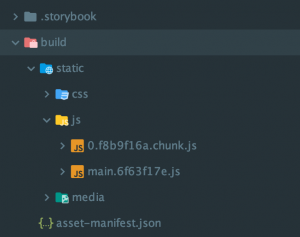
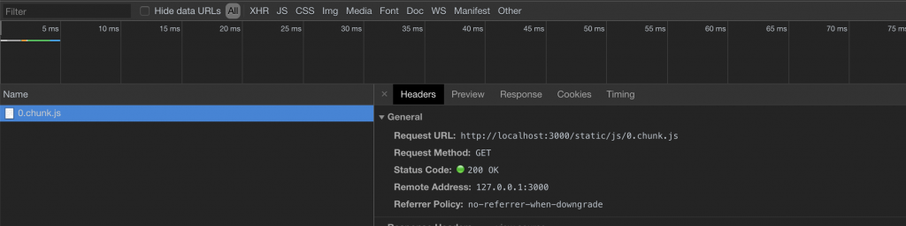

When I first got close to **client-side applications**, it felt natural to ask myself a few questions about
performance.

Many developers who build server-side **front-end** templates do not worry too much about this aspect, because the
server renders pages much faster than the client and applications of this kind are often
**MPAs (Multi Page Applications)**.

In a client-side context, and especially with a **SPA (Single Page Application)**, things change very quickly.

> The best way to build a fast and efficient application is to think of the client as your enemy. It will always work against you because of the limited resources it offers.

Let's take a **React**-based example. Imagine we have a client-side web app containing a component that is rendered by a
logical condition, for example a change in **state**. **The final result could look like this:**

```jsx
render() {
  const { ConditionalRender } = this.state;
  return (
    <div className="App">
      <header className="App-header">
        
        <h1 className="App-title">Welcome to React</h1>
      </header>
      {ConditionalRender &&
        <MyAwesomeComponent />
      }
    </div>
  );
}
```

In this case, `MyAwesomeComponent` will be included in the **Webpack** bundle, for example if you used
**Create React App**, even though the user may never actually see it, since the `ConditionalRender` state might never
change. In this specific example the saving may only be a few kilobytes, but in larger applications we force the user
to download elements that are not present in the current view, increasing **page load** more and more.

What we can do to improve this is use `dynamic imports`.

The basic idea is to split the components we do not want loaded in the main bundle into separate **chunks**.
To do that, we can build an **HOC** (Higher-Order Component) that loads components from outside the main package:

```jsx
// Async Component from Maximilian Schwarzmüller
import React, { Component } from 'react';

const asyncComponent = (importComponent) => {

  return class extends Component {
    state = {
      component: null,
    };

    componentDidMount() {
      importComponent()
        .then(cmp => {
          this.setState({ component: cmp.default });
        });
    }

    render() {
      const Chunk = this.state.component;
      return Chunk ? <Chunk {...this.props} /> : null;
    }
  };
};

export default asyncComponent;
```

This HOC component will actually load the real component through a `.then()`.

When we import our component, the code could look like this:

```jsx
const MyAwesomeComponent = asyncComponent(() => import('./components/MyAwesomeComponent'));

// some code

render() {
  const { ConditionalRender } = this.state;
  return (
    <div className="App">
      <header className="App-header">
        
        <h1 className="App-title">Welcome to React</h1>
      </header>
      {ConditionalRender &&
        <MyAwesomeComponent />
      }
    </div>
  );
}
```

You can see that `MyAwesomeComponent` is imported inside a function as if it were an argument. During the
**production build**, Webpack will create a chunk file thanks to the nested import of our component:

`() => import('./components/MyAwesomeComponent')`

This technique can also be used inside **routes**. In the case of `react-router-dom`, for example, it is enough to pass
the `MyAwesomeComponent` constant into the `Route` like this:

`<Route path="/example" component={MyAwesomeComponent} />`

Now, once you run **yarn build** or **npm run build**, depending on the package manager you use, you will be able to
see your chunk file inside the build folder.



If you open your **production Webpack configuration**, you can see the portion of code that creates our chunk files:

```jsx
output: {
  // The build folder.
  path: paths.appBuild,
    // Generated JS file names (with nested folders).
    // There will be one main bundle, and one file per asynchronous chunk.
    // We don't currently advertise code splitting but Webpack supports it.
    filename: 'static/js/[name].[chunkhash:8].js',
    chunkFilename: 'static/js/[name].[chunkhash:8].chunk.js',
    // We inferred the "public path" (such as / or /my-project) from homepage.
    publicPath: publicPath,
    // Point sourcemap entries to original disk location (format as URL on Windows)
    devtoolModuleFilenameTemplate: info =>
    path
      .relative(paths.appSrc, info.absoluteResourcePath)
      .replace(/\\/g, '/'),
},
```

If you launch your application now, you will notice that a network request is made when the application state changes.



Thanks to this technique, we can optimize the application by reducing bundle size and serving the user only what they
are actually viewing.

**In React 16.6, it is possible to split your application with a new and simpler feature. I recommend reading my
article about it: [How to Do Code Splitting with React and Suspense](/how-to-do-code-splitting-with-react-and-suspense/)**

**It is important to know that:** splitting your entire application into chunks is counterproductive, because you end up
forcing the user to request additional files for no reason. The app becomes smaller in size, but slower to load because
of the extra round trips.
