**Il 2019 è arrivato,** sarà un nuovo incredibile anno per il settore IT. Quale modo migliore di iniziarlo, se non
installando qualche nuova estensione di Chrome che potrà aiutarti al tuo rientro in ufficio?

Le estensioni di Google Chrome offrono tantissime possibilità, soprattutto per gli sviluppatori Web. Le reputo uno
strumento veramente utile per semplificare il lavoro di tutti i giorni.

Ecco perché ho deciso di elencare **17 estensioni che reputo indispensabili** in questo articolo!

## [Clear Cache](https://chrome.google.com/webstore/detail/clear-cache/cppjkneekbjaeellbfkmgnhonkkjfpdn)

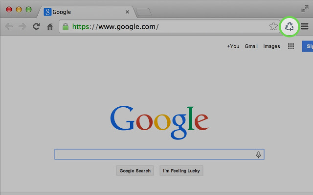

Svuota rapidamente la cache di un singolo sito web con questa estensione, grazie ad un singolo click! Nessuna finestra
di dialogo di conferma, popup o altro.

È possibile personalizzare quali e quanti dei dati si desidera cancellare nella pagina delle opzioni, tra cui: Cache
delle applicazioni, Cache, Cookie, Download, File system, Dati modulo, Cronologia, DB indicizzato, Archiviazione locale,
Dati plug-in, Password e WebSQL .

## [ColorPick Eyedropper](https://chrome.google.com/webstore/detail/colorpick-eyedropper/ohcpnigalekghcmgcdcenkpelffpdolg)

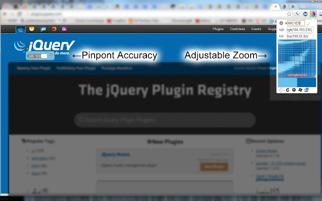

Questa estensione ti consente di selezionare un singolo pixel di una pagina web prelevandone il colore RGB.

E’ davvero molto utile, ti da la possibilità di copiare e incollare il valore istantaneamente tramite una lente di
ingrandimento e lo puoi utilizzare in un punto qualsiasi.

## [CSS3 Generator](https://chrome.google.com/webstore/detail/css3-generator/dmlgmehijaodgkkooghkknjjkddahmej)

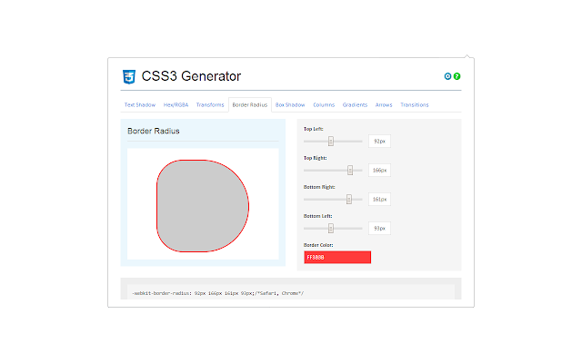

Un generatore CSS3 pratico per tutte le tue esigenze, direttamente all’interno del browser.

CSS3 Generator è un’estensione pratica che creerà il codice necessario per il tuo CSS. Attualmente genera codice
cross-browser (per quanto possibile) per molte proprietà CSS3, ad esempio:

1. Transforms
2. Border Radius
3. Box Shadow
4. Columns
5. Gradients

## [CSSViewer](https://chrome.google.com/webstore/detail/cssviewer/ggfgijbpiheegefliciemofobhmofgce)

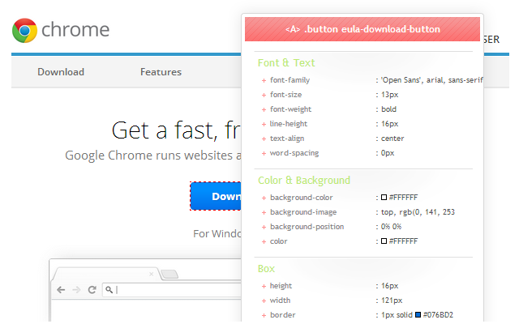

Grazie a questa estensione è possibile ottenere tutte le regole CSS di un singolo elemento del DOM. Tutte le
informazioni verrano mostrare in un popup. Questo tool può essere molto utile per ottenere rapidamente tutte le
informazioni di stile.

## [Dimensions](https://chrome.google.com/webstore/detail/dimensions/baocaagndhipibgklemoalmkljaimfdj)

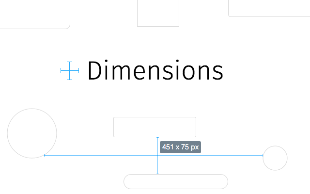

Ottimo strumento per designer, serve a misurare le dimensioni dello schermo. Questa estensione è in grado di rilevare le
misure dal puntatore del mouse al primo bordo rilevato in quell’area.

Se vuoi misurare le distanze tra gli elementi di un sito web questo è perfetto, puoi misurare immagini, input, bottoni,
video, gif, testo, icone e tanto altro.

## [Full Page Screen Capture](https://chrome.google.com/webstore/detail/full-page-screen-capture/fdpohaocaechififmbbbbbknoalclacl)

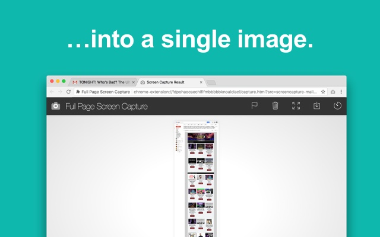

Cattura uno screenshot di una pagina Web per intero! E’ sufficiente fare clic sull’icona dell’estensione (o premere Alt + Maiusc + P) 
e verrai trasportato in una nuova scheda in cui è possibile scaricare lo screen come immagine o PDF o anche semplicemente trascinarla sul tuo desktop.

## [Grid Ruler](https://chrome.google.com/webstore/detail/grid-ruler/joadogiaiabhmggdifljlpkclnpfncmj)

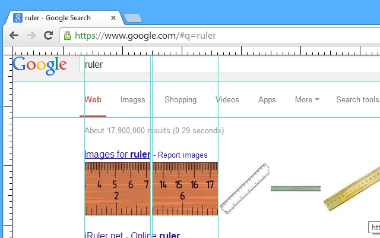

Con questa estensione puoi creare griglie e misurarne facilmente la loro distanza. Ti permette di creare griglie
verticali e orizzontali, in stile Photoshop.

E’ disponibile inoltre un righello per misurare le distanze.

## [HTML Hierarchy Visualizer](https://chrome.google.com/webstore/detail/html-hierarchy-visualizer/beaeppehjnnnidajcmalfcajahopihcb)

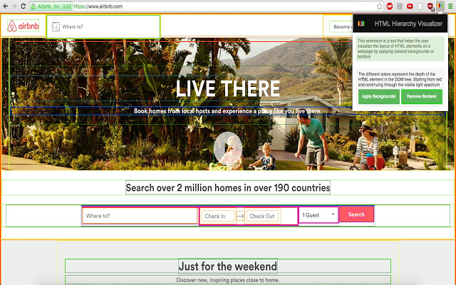

Questa estensione è uno strumento che aiuta a visualizzare il layout di elementi HTML in una pagina web.

HTML Hierarchy Visualizer è uno strumento di visualizzazione per sviluppatori Web Front-end che aiuta a comprendere la
suddivisione e la nidificazione dei vari elementi del DOM, creando bordi e sfondi colorati per distinguerli fra loro.

## [JSON Viewer](https://chrome.google.com/webstore/detail/json-viewer/gbmdgpbipfallnflgajpaliibnhdgobh)

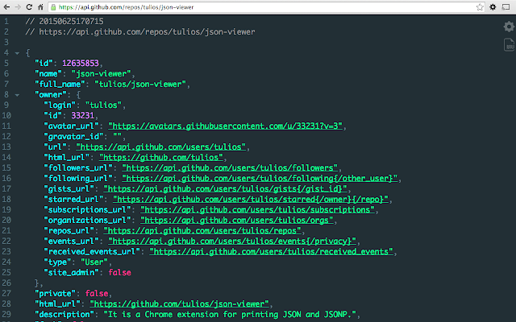

Estensione molto utile per visualizzare i JSON all’interno del tuo browser. E’ possibile modificare il colore e
raggruppare i vari oggetti per migliorare la visualizzazione del documento.

## [Library Detector](https://chrome.google.com/webstore/detail/library-detector/cgaocdmhkmfnkdkbnckgmpopcbpaaejo)

Rileva le librerie JavaScript in esecuzione su una pagina e visualizza le loro icone nella barra degli indirizzi.

L’estensione Library Detector mostra quali librerie JavaScript vengono utilizzate nelle pagine Web visualizzando anche
un collegamento alla homepage della libreria, nella barra degli indirizzi.

## [Page load time](https://chrome.google.com/webstore/detail/page-load-time/fploionmjgeclbkemipmkogoaohcdbig)

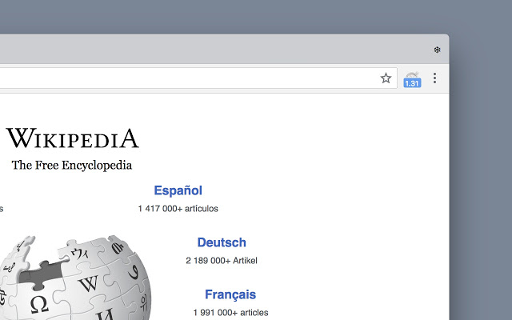

Questa estensione misura il tempo di caricamento della pagina e lo visualizza nella barra degli strumenti.

Una volta cliccato sull’icona, al termine del caricamento sarà possibile vedere nel dettaglio le varie fasi come ad
esempio quanto tempo impiega il DOM a processarsi.

## [Performance-Analyser](https://chrome.google.com/webstore/detail/performance-analyser/djgfmlohefpomchfabngccpbaflcahjf)

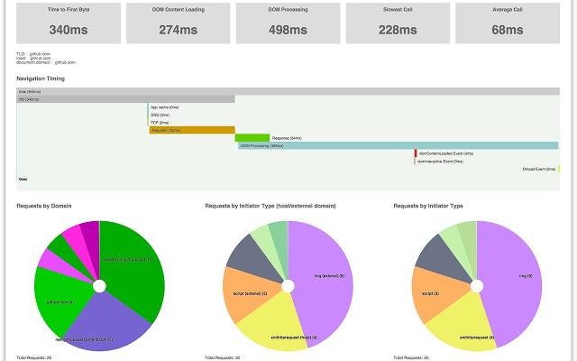

Ottieni informazioni dettagliate sulle prestazioni di sito Web, questa estensione è una sorta di mini versione live di
WebPageTest.

Performance-Analyzer aiuta ad analizzare la pagina corrente attraverso le API di Resource, Navigation e User Timing.
Puoi vedere le richieste per tipo, dominio, tempi di caricamento e altro.

## [React Developer Tools](https://chrome.google.com/webstore/detail/react-developer-tools/fmkadmapgofadopljbjfkapdkoienihi)

Aggiunge gli strumenti di debug di React agli Strumenti per sviluppatori di Chrome.

React Developer Tools è un’estensione per Chrome per la libreria React. Permette di ispezionare le gerarchie dei
componenti, verificare le Props in ingresso e tanto altro.

## [The New Tab – Customize Your Chrome Start Page](https://chrome.google.com/webstore/detail/the-new-tab-customize-you/ddjdamcnphfdljlojajeoiogkanilahc)

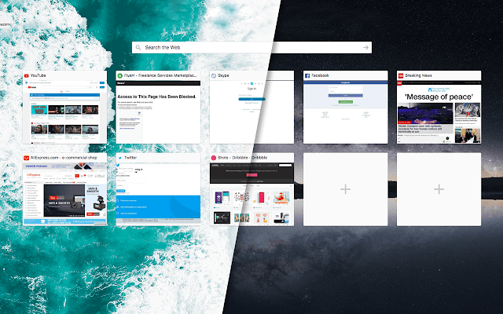

Grazie a queste estensione potrai aggiungere tutti i link che preferisci in una “nuova scheda” di Chrome.

Potrai deciderne il numero, modificare lo sfondo e tanto altro! Io personalmente lo uso per tenere in home tutte le
migliori testate giornalistiche in ambito IT.

## [Web Maker](https://chrome.google.com/webstore/detail/web-maker/lkfkkhfhhdkiemehlpkgjeojomhpccnh)

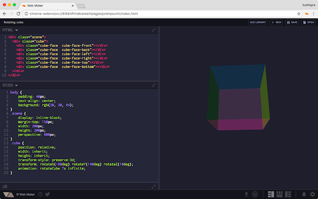

Questa estensione ti offre una sandbox accessibile e offline per i tuoi esperimenti web.

Perfetto per gli sviluppatori che desiderano sperimentare o praticare con HTML/CSS/JS rapidamente, anche senza
Internet.

## [TunnelBear VPN](https://chrome.google.com/webstore/detail/tunnelbear-vpn/omdakjcmkglenbhjadbccaookpfjihpa)

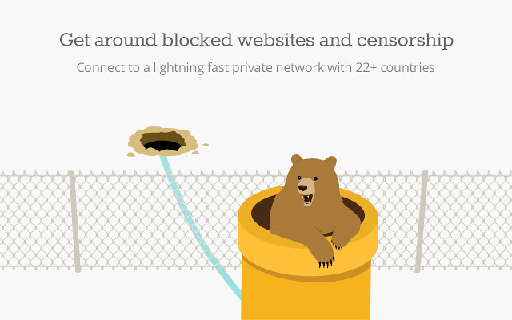

Grazie a TunnelBear è possibile simulare connessioni da altri paesi, inoltre:

Ridurre la possibilità per siti Web, inserzionisti e ISP di tracciare la tua navigazione, proteggere il proprio browser 
su WiFi pubblici e visitare siti Web bloccati in paesi specifici.

## [Vue.js devtools](https://chrome.google.com/webstore/detail/vuejs-devtools/nhdogjmejiglipccpnnnanhbledajbpd)

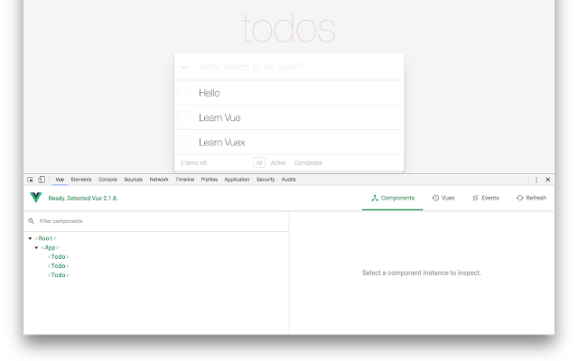

Esattamente come il React Developer Tools, Vue.js devtools aiuta ad eseguire il debug dell’applicazione Vue.js. Inoltre
questa estensione consente anche di verificare lo stato della tua app tramite lo state managment Vuex.
