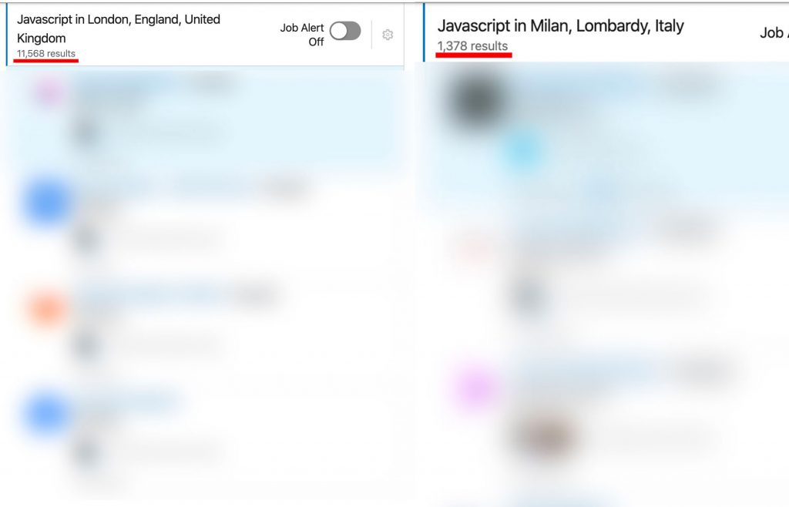

**London vs Milan**, which is the better hub for software engineers? Where is the technology better and where do you
earn more?

I strongly believe that the profession of **Software Engineer** is one of the most in-demand and international careers
of our time. Today, knowing a programming language is more important than knowing a spoken language.

A programming language can take you anywhere, because it is a universal method of communication. There is always a
product that will speak your language.

At a certain point in my career, my hometown (**Ferrara**) started to feel too small, so I decided to look at what the
Italian market had to offer.

I made a great discovery: **Milan**.

What I discovered in Milan changed my perception of business forever. **Milan is a racing machine and, broadly
speaking, its software scene is by far the best in Italy**. Of course, there are excellent companies in every city, but
I am talking at a general level here.

Almost two years later, Milan had irreversibly shaped my mind with a more international market vision, so I decided to
take another step: move to **London**.

**Today I live and work in London as a Senior JavaScript Engineer for a large British company.**

Like **Milan**, **London** also offers endless opportunities, **but which one is better?**

**Which of these two huge cities offers more opportunities to a software engineer?**

Over the last few years I have gathered a good amount of information, and I think I can give you a fairly precise
answer **if you are considering an IT career in London**, or even if you are simply curious.

## Job opportunities

By doing a quick LinkedIn search using the keyword "**JavaScript**" in Milan and London, at the time of writing, you
can see the following result:

**11,568 results** for **London** versus **1,378 results** for **Milan**.

Clearly, this cannot be taken as an absolute value. London offers more jobs partly because it is a city of almost
**9 million** people, versus about **3 million** for Milan including the metropolitan area, and it is also much larger
in terms of surface area. Even so, it is an interesting figure and it certainly shows a strong involvement from the
city in the tech sector, with the proportion clearly leaning toward the British side.

London is also a more international city where many major brands operate, such as **Google, Twitter, Spotify, Amazon,
Microsoft, and Sony**, among many others. In Milan it is much harder to find these companies doing actual software
development rather than simply running commercial offices.

Overall, London offers roughly **three times more opportunities than Milan**, not only because of the higher demand but
also because of the large names present in its tech ecosystem. We should not forget that English is spoken there, a
language that is relatively simple, widely accessible, and above all global.

Just to give you an indicative number, there are **12 different languages** spoken in my office alone, and across all
of London more than **300 different languages** are spoken. **Of course, business is conducted in English**, but these
numbers clearly show the city's cultural diversity.

###### <u>LONDON 1 - MILAN 0</u>

## Technology

In Milan I found the best software scene in Italy. As in every city, there are "**old**" companies and "**new**"
companies in terms of technology stack, but this is definitely a major point in Milan's favor when you consider it in
its own context.

**Milan is also the most active city in Italy when it comes to technology meetups**, for example Milano Front-end with
its 2,000+ members and events scheduled every month.

Now, if we scale this comparison up, **the Lombard city may lose its crown.**

I have been fortunate enough to work at a fairly high level in both cities and **what I have observed so far is**:

1. London has a huge number of startups and innovative projects launching every single day. For example, both **Revolut** and **Monzo**, the two banks that completely reshaped fintech, are British and operate in London. In practice, you are much more likely to work on new projects than on **legacy** code.
2. London has a **stronger software testing culture**. A large portion of the software is regularly tested through unit testing, integration testing, and end-to-end testing. TDD is also much more popular, and the QA role is more common in software teams.
3. London generally has a **stronger technology stack**: environments are containerized, there is a great deal of attention paid to functional programming and concepts like immutability, and it is very easy to find one or more DevOps engineers even in a small company, which makes CI/CD more widespread. Many companies are also comfortable experimenting with new technologies and new approaches to software development.
4. The number of technology meetups in London is extremely high, probably the biggest scene I have ever seen, and the quality is high too. You can even find **10 different events on the same day**:

###### <u>LONDON 2 - MILAN 0</u>

## Salaries

This is definitely a very important and interesting topic for **every software engineer's career.** Where do you earn
more? In London or in Milan?

The answer is: **in London.**

Some people might say that this is obvious because London is a more expensive city. **The truth is that this statement
is only partly correct.** Salaries can be double or triple those in Milan, and the difference can be so large that the
higher cost of living is not enough to cancel it out.

I compared one year in Milan with one year in London and, after considering all expenses, I ended up with more money in
my pocket in London.

**I will try to compare each level bracket.** Obviously salary varies depending on the programming language, so this
example is based on JavaScript roles:

**Junior Software Engineer (gross annual salary):**

* **LONDON**: 35k-45k
* **MILAN**: 21k-23k

**Mid-level Software Engineer (gross annual salary):**

* **LONDON**: 45k-60k
* **MILAN**: 28k-36k

**Senior Software Engineer (gross annual salary):**

* **LONDON**: 60k-90k
* **MILAN**: 36k-45k

As you can see, the London range is wider, as in the case of the **Senior Software Engineer**, where salary goes from
**60k to 90k**. I have even heard of senior salaries reaching 120k in the UK. This happens because in England pay
changes a lot depending on your responsibilities, regardless of your level. More than once in Milan I found **junior**
profiles carrying **senior** responsibilities.

Another very important point is that **the body-rental model is much less common in London.** It is much easier to find
contractors working directly with end companies without intermediaries.

###### <u>LONDON 3 - MILAN 0</u>

## Quality of life

Quality of life matters a lot. Work cannot be everything, even if some people think otherwise.
**Which city is better to live in? Which city feels more human-scale?**

The answer is: **Milan.**

**If you think Milan is too crowded, too full of tourists, and unlivable, you are very wrong.**

London is a very intense city, at least five times more intense than Milan. **It never switches off** and is always in
the top three most visited cities in the world.

Many shops are open **24 hours a day**, some supermarkets close at midnight, and there are countless forms of public
transport carrying millions of people every day on **trains, the Tube, the DLR, buses, trolleybuses, taxis, and more**.

Distances are huge, much bigger than in Milan, and driving in London during rush hour is nearly impossible. **Compared
to it, Milan's ring road feels empty.**

London has so many clubs, events, and different activities that a whole lifetime probably would not be enough to try
them all.

Clearly, these facts can be interpreted differently. **For some people they are strengths, for others they are
drawbacks.** In my case, I think Milan is a more human-scale city. It is more compact and orderly, there are far fewer
people, and it is relatively easier to get around by car.

**London is absolutely livable too**, but it is important to remember that it operates on the scale of New York, with
all the advantages and drawbacks that implies.

###### <u>LONDON 3 - MILAN 1</u>

## Conclusions

Taking everything into account, **I think London is a better city than Milan** for a software engineer. **You earn more
and you generally work better.**

When it comes to quality of life, I still consider London a very strong city, even if I rate it below Milan on this
specific point. As a dear friend of mine says, **"you can never have it all."**

And Brexit? Are you worried? Do not be. Your profession is one of the most in-demand on the market. **They will roll
out a long red carpet for you the moment you set foot on British soil. If you do not believe me, read
this [article](/why-programmers-will-be-the-rockstars-of-the-future/).** It is very easy to obtain
"pre-settled status", a document that allows you to **stay in the United Kingdom for 10 years** (renewable after 5)
with the possibility of getting citizenship at the end of those 10 years.

What do you think? Are you considering moving to London, or do you already live there?
