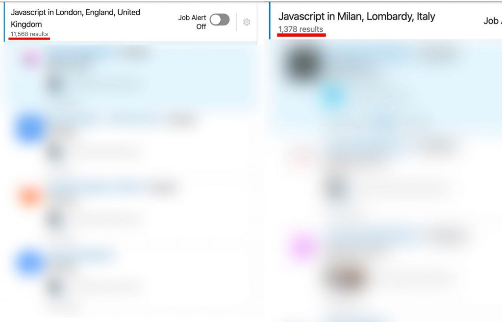

**Londra VS Milano**, qual’è la migliore piazza per Software Engineers? Dove la tecnologia è migliore e dove si guadagna
di più?

Sono fermamente convinto che la professione di **Software Engineer** sia una delle più ricercate ed internazionali dei
nostri tempi. Oggi, sapere un linguaggio di programmazione è più importante di conoscere una lingua.

Un linguaggio di programmazione può portarti ovunque, perché è un metodo di comunicazione universale, c’è sempre un
prodotto che parlerà la tua lingua.

Ad un certo punto della mia carriera informatica la mia città natale (**Ferrara**) iniziò a starmi stretta, così decisi
di guardare quello che offriva il panorama italiano.

Feci una gran bella scoperta: **Milano**.

Quello che ho scoperto a Milano ha modificato per sempre la mia percezione di business. **Milano è una macchina da corsa
e il software Milanese è di gran lunga il migliore d’Italia** (chiaramente ci sono ottime aziende in tutte le città ma
qui si parla a livello generale).

Quasi 2 anni dopo, Milano aveva contaminato irrimediabilmente la mia mente con una visione di mercato internazionale,
così decisi di fare un altro step: andare a **Londra**.

**Oggi vivo e lavoro stabilmente a Londra come Senior JavaScript Engineer per una grossa società inglese.**

Anche **Londra** come **Milano** offre infinite opportunità, **ma qual’è migliore?**

**Quale di queste due enormi città offre più possibilità ad un/una Software Engineer?**

Ho catalogato un buon numero di informazioni negli ultimi anni e penso di poterti dare una risposta abbastanza
precisa **se stai considerando di intraprendere un carriera IT a Londra** o anche solo per curiosità personale.

## Opportunità di lavoro

Facendo una rapida ricerca su LinkedIn utilizzando la keyword “**JavaScript**” su Milano e Londra (data articolo) è
possibile verificare il seguente risultato:

**11.568 risultati** per **Londra** contro **1.378 risultati** per **Milano**.

Chiaramente questo non può essere preso come un valore assoluto, Londra offre più posti di lavoro se consideriamo
soprattuto che è una città con quasi **9 milioni** di abitanti contro i circa **3 milioni** di Milano (area
metropolitana inclusa) e con una superficie nettamente superiore. Ad ogni modo è un dato interessante e sicuramente
dimostra un grande coinvolgimento da parte della città nel settore informatico oltre al fatto che la proporzione pende
dalla parte della città Britannica.

Londra inoltre è una città più internazionale in cui operano molti grandi brand come: **Google, Twitter, Spotify,
Amazon, Microsoft, SONY** (e molti altri) che difficilmente possiamo trovare a Milano se non nelle vesti di uffici
commerciali anziché di sviluppo software vero e proprio.

In linea di massima Londra (tutto considerato) offre circa **3 volte più possibilità rispetto Milano**, non solamente
per la grande richiesta ma anche per via di grandi nomi presenti nel panorama IT. Non dobbiamo inoltre dimenticare che
si parla la lingua Inglese, una lingua estremamente semplice ed accessibile a tutti ma soprattutto globale.

Solo per darvi un dato indicativo, nel mio ufficio sono presenti **12 lingue diverse** e in tutta Londra vengono parlate
più di **300 lingue diverse**. **Chiaramente in ambito business si parla solo Inglese**, ma questi numeri dimostrano
sicuramente la grande diversità culturale della città.

###### <u>LONDRA 1 – MILANO 0</u>

## Tecnologia

A Milano ho trovato il miglior software d’Italia, chiaramente come in tutte le città è possibile trovare aziende “**vecchie**” e aziende “**nuove**” in termini di stack tecnologica ma questo è sicuramente un grosso punto a favore per
Milano se la consideriamo nel suo contesto.

**Milano è la città più attiva in Italia anche per i Meetup sulla tecnologia** (vedi ad esempio Milano Front-end con i
suoi oltre 2000 iscritti ed appuntamenti schedulati ogni mese).

Ora, se portiamo questo paragone su una scala più grande, **la città lombarda potrebbe perdere il suo trono.**

Ho avuto la grande fortuna di lavorare a livelli abbastanza alti in entrambe le città e **quello che ho constatato fino
ad oggi è**:

1. Londra ha moltissime startup e progetti innovativi in partenza ogni singolo giorno, ad esempio sia **Revolut** che **Monzo** (le 2 banche che hanno totalmente rivoluzionato Fintech) sono inglesi ed operano a Londra. Di fatto è molto più probabile che finirete a lavorare su progetti nuovi anziché su codice **Legacy**.
2.  Londra ha una **cultura del Software Testing superiore**, gran parte del software viene testato regolarmente attraverso Unit testing, Integration testing ed E2E testing. Inoltre l’approccio TDD è molto più popolare e la figura del QA in ambito software è più diffusa.
3. Londra ha una **stack tecnologica generalmente superiore**: qualsiasi ambiente viene dockerizzato, c’è una grande attenzione verso la programmazione funzionale e verso concetti come l’immutabilità ed è molto facile trovare uno o più Dev-Ops anche in una piccola azienda e di conseguenza la CI/CD è più diffusa. Inoltre molte società non si fanno problemi a sperimentare nuove tecnologie o nuovi approcci al software development.
4. Il numero di Meetup a Londra in ambito tecnologico è veramente elevato (probabilmente la piazza più grande che abbia mai visto) e di qualità, possiamo trovare anche **10 eventi diversi solo nello stesso giorno**:

###### <u>LONDRA 2 – MILANO 0</u>

## Stipendi

Questo è sicuramente un topic molto importante ed interessante per la **carriera di ogni Software Engineer.** Dove si
guadagna di più? A Londra o a Milano?

La risposta è: **a Londra**

Alcuni potrebbero rispondere: è normale, perché Londra è una città dove la vita costa di più. **La verità è che questa
affermazione è vera solo in parte.** Gli stipendi possono essere il doppio o il triplo rispetto a Milano e di fatto la
differenza potrebbe essere talmente grande da non giustificare il costo più alto della vita.

Ho paragonato 1 anno Milano con 1 anno a Londra e considerato tutte le spese mi sono trovato con più soldi in tasca a
Londra.

**Cercherò di confrontare ogni fascia di livello**, chiaramente lo stipendio varia in base al linguaggio di
programmazione, quindi lo schema verrà costruito sulla base di linguaggio JavaScript per questo esempio:

**Junior Software Engineer (annuo lordo):**

* **LONDRA**: 35/45k
* **MILANO**: 21/23K

**Middle Software Engineer (annuo lordo):**

* **LONDRA**: 45/60k
* **MILANO**: 28/36K

**Senior Software Engineer (annuo lordo):**

* **LONDRA**: 60/90k
* **MILANO**: 36/45K

Come avrete notato la forbice di Londra è più ampia, come nel caso del **Senior Senior Software Engineer** dove lo
stipendio varia da **60 a 90k** (ho udito anche di stipendi senior da 120k in UK). Questo è dovuto al fatto che che
Inghilterra lo stipendio cambia molto in base al tue responsabilità, indipendentemente dal tuo livello. Più volte a
Milano mi sono trovato davanti figure **Junior** con responsabilità da **Senior.**

Un altro dato molto importante da considerare è che **a Londra la pratica del Body Rental è molto meno diffusa,** è
molto facile trovare contractors che lavorano direttamente con le aziende finali senza intermediari.

###### <u>LONDRA 3 – MILANO 0</u>

## Qualità della vita

La qualità della vita è molto importante, non può esistere solo il lavoro (anche se alcuni la pensano diversamente). 
**Dove si vive meglio? Quale città è più a “formato d’uomo”?**

La risposta è: **a Milano**

**Se pensate che Milano sia una città troppo popolosa, piena di turisti ed invivibile vi sbagliate di grosso.**

Londra è una città molto intensa, almeno 5 volte più di Milano, **non si spegne mai,** è sempre nella top 3 delle città
con più turisti al mondo.

Molti negozi sono aperti **24 ore su 24**, alcuni supermercati chiudono a mezza notte. Ci sono caterve di mezzi pubblici
diversi che trasportano milioni di persone ogni giorno su **treni, metropolitana, DLR, autobus, filobus, taxi ecc.**

Le distanze sono immense, molto più grandi che a Milano, inoltre utilizzare la macchina a Londra in orari di punta è
impossibile, **la tangenziale di Milano al confronto sembra deserta.**

A Londra ci sono talmente tanti club, eventi e attività diverse che probabilmente non basterà una vita intera per
provarli tutti.

Chiaramente questi dati possono essere interpretati personalmente, **per alcuni possono essere un pregio, per altri un
difetto**. Nel mio caso penso che Milano sia una città più a “formato d’uomo”, è più composta ed ordinata, ci sono molte
meno persone ed è relativamente più semplice da attraversare in auto.

**Chiaramente anche Londra è perfettamente vivibile**, ma bisogna ricordarsi che è una città sulla scala di New York,
quindi con i suoi pregi e difetti.

###### <u>LONDRA 3 – MILANO 1</u>

## Conclusioni

Considerando tutto **penso che Londra sia una città migliore di Milano** per un/una Software Engineer. **Si guadagna di
più e si lavora meglio.**

Per quanto riguarda la qualità della vita, considero Londra molto valida seppur inferiore a Milano per questo aspetto,
citando un mio caro amico: **“La coperta è sempre troppo corta”**.

E Brexit? Sei preoccupato/a? Non esserlo, la tua professione è una delle più richieste dal mercato, **ti stenderanno un
lungo tappeto rosso appena metterai piedi sul suolo britannico (se non ci credi leggi
questo [articolo](/perche-i-programmatori-saranno-le-rockstar-del-futuro/)).** E’
molto semplice ottenere il “pre-settled status”, un documento che ti consentirà di **rimanere 10 anni** (rinnovabile
dopo 5) nel Regno Unito con possibilità di ottenere la cittadinanza allo scadere dei 10.

E tu cosa ne pensi? Stai pensando di trasferirti a Londra oppure ci vivi attualmente?
