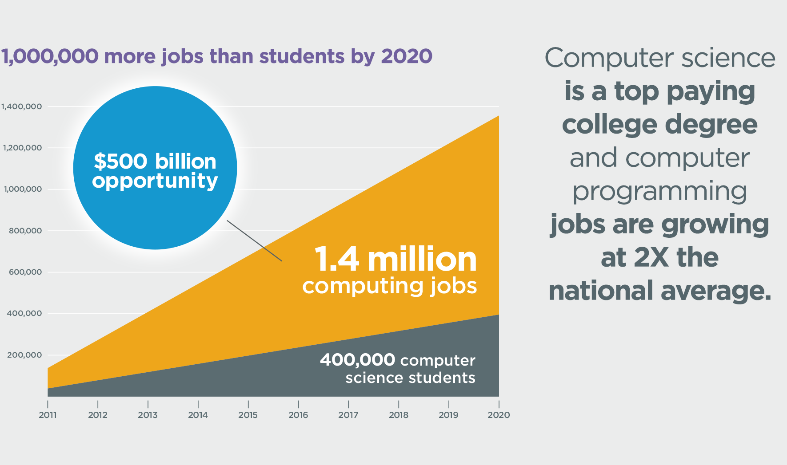

La prima volta che ho deciso di avvicinarmi al settore IT, avevo 17 anni. **Era il 2010** e per darvi un idea di quanto
scorre rapidamente il tempo, **il 27 Luglio dello stesso anno** Apple aveva introdotto **iPhone 4** nel mercato e il **6
ottobre** usciva **Instagram.**

Il concetto di **“Mobile First”** era ancora alquanto astruso. **Amazon** aveva solo 24.000 dipendenti, **Netflix** non
era ancora nei nostri pensieri e sicuramente nessuno di noi si sarebbe immaginato che la tecnologia potesse avere un
impatto così esteso nelle nostre vite quotidiane.

Che cosa è successo in questi 9 anni? **Una gigantesca esplosione di grandi opportunità ha creato un mondo nuovo che
neppure i più visionari avevano previsto.**

Nel 2010 sembrava un gioco, parenti ed amici reputavano ancora il settore IT come qualcosa di “misterioso” ed “opaco”.
Ricordo ancora la frase: **sei sicuro che le aziende cerchino profili come il tuo?**

Lo sappiamo, l’Italia è sicuramente un bellissimo paese, purtroppo però alcuni concetti faticano a consolidarsi per
tempo. La parola programmatore è sempre stata associata alla parola **“smanettone”** ed inoltre, non sono ancora sicuro
che oggi il significato della parola **Design** sia stato pienamente compreso.

Per molti, **il programmatore è sempre stato associato al Nerd**, un’entità oscura, chiuso in uno scantinato con un
computer a schermo tubo catodico. **Un personaggio evanescente**, misterioso ed incompreso. Circondato da sensazioni di
nullafacenza.

Oggi invece, **nel 2019 la situazione è diversa.** La coscienza delle persone si sta rovesciando e i programmatori
stanno cambiando.

Oggi il programmatore è un personaggio cool, alla moda. **Un’artista dannato.** Non ha più il monitor a tubo catodico,
ora ha il MacBook Pro di ultima generazione, ultra sottile e super leggero. Non è più nello scantinato, ora lavora al
19° piano di una grande società di software.

Il programmatore moderno, è molto ambito e se è bravo viene pagato parecchio. Ed è perfettamente cosciente di tutto
questo.

**Oggi il settore IT è il mercato con la domanda più grande in assoluto.** E a quanto ammonta secondo voi l’offerta? In
questo momento solo il 2% degli studenti scelgono questo indirizzo, ma l’IT rappresenta il 60% dei lavori STEM-related (
Science, Technology, Engineering, Math) attualmente disponibili.

Secondo le stime **nel 2020 ci saranno circa 1 milione di posti di lavoro** in più del numero di studenti laureati in
questo campo.

Da queste statistiche possiamo trarre **2 conclusioni possibili:**

1. Non è necessario avere una laurea per lavorare nel settore IT (considerato il livello di informazioni disponibile online) e qui vi consiglio di leggere l’articolo ormai celebre: [You Don’t Need a College Degree to be a Software Developer!](https://programmingwithmosh.com/general/dont-need-college-degree/)
2. Data la grande domanda e la poca offerta, gli stipendi saranno più elevati e le possibilità di una carriera di successo in questo settore saranno di fatto maggiori.

**Ormai è chiaro come il sole,** tutto il mondo sta convergendo verso la tecnologia. Pensate a ciò che le persone fanno
durante il giorno: si collegano continuamente ad Internet da device di vario genere, utilizzano applicazioni, guardano
contenuti in streaming, condividono foto e sensazioni sui social, gestiscono la domotica di casa tramite un app, pagano
tramite il loro smartphone e tanto altro.

Prendiamo ad esempio le grandi società come **Amazon, Apple, Netflix e Airbnb.** Stanno crescendo sempre di più. Creano
nuovi lavori e così nuove opportunità. In pochi anni i possibili lavori in ambito IT sono cresciuti in maniera
esponenziale, ad esempio troviamo professioni (prima inesistenti) come:

_Cloud Architect, IT Director, Senior System Designer, Front End Developer, Data Center Support Specialist, Senior
Network Architect **e tantissimi altri!** per la lista completa ti consiglio di
leggere [List of Information Technology (IT) Job Titles](https://www.thebalancecareers.com/list-of-information-technology-it-job-titles-2061498)._

**Viviamo in tempi mistici,** ogni giorno, quando leggo le testate giornalistiche in ambito IT, qualcuno da qualche
parte nel mondo ha inventato qualcosa di nuovo. Questo settore cresce più velocemente delle società stesse che lo
finanziano.

Amazon nel 2010 aveva circa 24.000 dipendenti, **oggi:**

**Numeri spaventosi non è vero?**

Il vaso ormai è aperto, questo è un treno che sta viaggiando ad una velocità incalcolabile. Però sappi, che puoi ancora
salirci e il momento è ora.

Ogni giorno vedo persone che dal niente, iniziano a studiare con lo scopo di diventare **Front-end Developer o UX
Developer** (ad esempio), per poi abbandonare il loro vecchio lavoro.

Una nuova era digitale è iniziata e il mondo sta reagendo, guarda il numero di siti Web dal 2000 ad oggi:

**Un giorno, i programmatori migliori saranno le Rockstar della società moderna e avranno stipendi e ruoli di grande
prestigio.** L’informatica sarà la padrona del mondo intero.

Tutto verrà digitalizzato è solo questione di tempo. **E’ molto importante però rimanere connessi alla realtà**, bisogna
saper preservare se stessi in questa grande epoca informatica. Ecco perché ti consiglio di leggere il mio
articolo: [Kit di sopravvivenza per sviluppatori Web](/kit-di-sopravvivenza-per-sviluppatori-web/).
