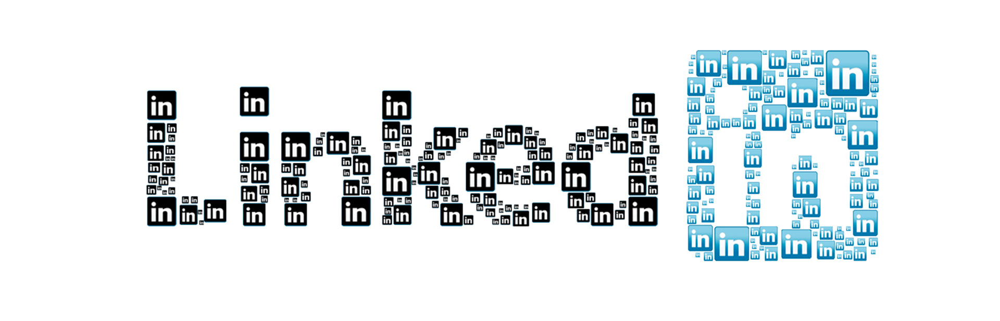

**The Internet is a jungle.**

IT is a tricky industry. On one side, technology evolves at lightning speed. On the other, the market is growing
extremely fast and becoming more demanding every day.

**The modern web developer** needs to keep up with the times, understand market trends, bet on the right technologies,
and above all be ready to reinvent their way of working whenever the market demands it.

_Constant updates, ever-evolving technology, new devices, new resolutions, operating systems, browsers, backward
compatibility, crazy managers, user experience, insane deadlines, user interfaces, and so on..._

**Quite a mix, isn't it?**

The world of work as previous generations knew it no longer exists. We cannot stop. We have to evolve.

The Web is probably one of the fastest-changing industries of all.

**How can you survive all of this without going crazy or giving up your social life?** In reality, it is much simpler
than it seems.

**The secret is organization.**

I created this **survival kit** to help you stay sharp in **Web 3.0** while still having a life.

## Lifestyle

**You need to "program" yourself before your application.**

I want to start with lifestyle, because I believe it is essential if you want to stay consistently effective over time.

A web developer's lifestyle matters a lot and unfortunately it is often the weakest point of our profession. Very often
we bring work home, think about a technical problem while having lunch, skip breaks when we should not, and so on.

**All wrong.**

To be truly effective as a web developer, you do not need to work until 3:00 in the morning. **If you do, it means you
do not have a method.**

The key is to work with **consistency and precision**, without useless distractions such as WhatsApp or Facebook while
you are at work, and to do your job when it is time to do it. You also need to take proper breaks every two hours to
rest your mind, **but above all give yourself a STOP time.**

> An overloaded mind is not an efficient mind.

For many years I made the same mistake, to the point that I even dreamed about code.

**This is the result of a flawed way of working.**

The point is that stress and fatigue destroy your creativity. Working 14 hours in a row is equivalent to working 8, if
not less. It is much better to focus on the quality of your time rather than the quantity. After a certain point your
brain will start responding poorly and make you commit terrible mistakes.

At this point many people will probably think, **"but the project had to be delivered yesterday."** What I can tell you
is this: if you have reached that point, either you or someone else on the team is not respecting this rhythm. Of
course, there are exceptional cases.

Another fundamental aspect of staying sharp is **maintaining contact with reality.** I am sure you cannot wait to try
the latest version of **Webpack**, or study the latest additions to **React** or **Angular**. What I am about to say
may sound like heresy.

**The best thing to do after work is to go out**, spend time in a park, by a lake, or at the beach with friends. I am
not saying you need to disconnect forever, but you do need to let your mind rest. This has an extremely positive impact
on your work method and your ideas. They become better because they come from a fresh, bright mind. The next morning
you can catch up on the latest web news. Of course, sometimes you may stay longer at work, but it should never become
the rule.

**There is a time to work and study, and a time for yourself.**

I also recommend avoiding junk food and fizzy drinks. Eat fresh meals and lots of fruit instead, foods that are easy to
digest.

This will have a major impact on your ideas. Junk food is hard to digest and it quietly steals energy from your body
without you realizing it.

**Sport is another pillar.** I go running every day after work, in places **where nature is present, not buildings.**
This helps me clear my mind and, in some cases, have new insights.

## Talking with colleagues

**Never think of yourself as the best.** That would be your biggest mistake.

I spend a lot of time talking with colleagues and I recommend you do the same. No matter how smart someone thinks they
are, someone else may still have had a better idea. That is why, even when I believe my approach is correct, I want to
hear other voices.

It sounds ridiculous, but most of the useful IT updates and many of the ideas that turned out to be extremely valuable
**came from my colleagues during a coffee break conversation.**

That is why I believe comparing ideas with others is one of the pillars of growth in this industry.

## Online articles

Of course, if you want to stay up to date you need to read the best industry publications every day to discover
interesting news. They can be extremely useful in your work, give you new ideas, and satisfy your curiosity. This
matters a lot if you do not want to fall behind technologically and if you want to maintain a constant overview of the
market. **We always need to stay ahead of the curve.**

I installed
[this Chrome extension](https://chrome.google.com/webstore/detail/the-new-tab-customize-you/ddjdamcnphfdljlojajeoiogkanilahc),
which lets me add all the links I want to my new tab page, so every morning I can do a proper learning round.

These are some of the best publications for staying up to date in the web space, both front end and back end. You can
find news and implementation examples around the latest technologies such as **React, Angular, Node.js, and much
more.**

1. [Medium](https://medium.com/topic/javascript)
2. [Hacker Noon](https://hackernoon.com/tagged/software-development)
3. [Pony Foo](https://ponyfoo.com/articles)
4. [Scotch](https://scotch.io/)
5. [DailyJS](https://medium.com/dailyjs)
6. [Codeburst](https://codeburst.io/)
7. [Sitepoint](https://www.sitepoint.com/javascript/)

## Meetups

What better way to stay up to date than by going to a [Meetup](https://www.meetup.com/)? Personally, I love this
platform. It is full of free events related to the web industry and beyond. You can find entire communities that organize
**weekly or monthly** meetups where a speaker usually talks for an hour or more about a hot topic in the web space.

In **Milan**, the city where I live, there are many communities that offer this for free, such as
[Milano Frontend](https://www.meetup.com/milano-front-end/), [Milano JS](https://www.meetup.com/Milano-JS/),
and many others.

So I recommend going to these events, talking with other developers, and following local Meetups. If you do not live
near Milan, look for the ones available in your area, and if there are none, create them yourself.

## Training

I believe professional training is vitally important. **Isn't it great when your company invests in you by providing
courses that are relevant to your profession?**

There are two types of training: online and in person.

Personally, I invest a lot of time in online learning, although I consider in-person training just as important. Let me
recommend a few very solid platforms that can help you stay up to date on almost any web topic:

1. [Udemy](https://www.udemy.com/)
2. [Egghead](https://egghead.io/)
3. [Pluralsight](https://www.pluralsight.com/)
4. [Treehouse](https://teamtreehouse.com/)
5. [Udacity](https://eu.udacity.com/)

On Udemy, for example, you can find many low-cost, high-quality courses, and most of these platforms also offer
business solutions for companies. **Why not suggest one to yours?**

## Recruiting platforms

When you become a real pro in this field, the door opens to **a flood of job offers**, because our industry is
exploding.

That is why I recommend using [LinkedIn](https://www.linkedin.com/) if you are looking for a job or simply evaluating
new opportunities.

If you take care of your profile, fill it with accurate information and detailed professional experiences relevant to
what you are looking for, and stay active on this professional social network, you will be contacted by recruiters, the
people responsible for finding, evaluating, and selecting candidates for open roles.

**I can assure you that this platform works very well. In some months of the year I have even received 10 direct job
offers in a single day.**

**By investing in yourself, in training, and in communicating with others, you can achieve more in a few months than in
years of programming alone.**

I hope this short guide helps you in the wild world of Web 3.0.
