**2019 is here,** and it is going to be another incredible year for IT. What better way to start it than by installing
some new Chrome extensions that can help you when you get back to the office?

Google Chrome extensions offer a huge number of possibilities, especially for web developers. I consider them genuinely
useful tools for simplifying day-to-day work.

That is why I decided to list **17 extensions that I consider essential** in this article.

## [Clear Cache](https://chrome.google.com/webstore/detail/clear-cache/cppjkneekbjaeellbfkmgnhonkkjfpdn)

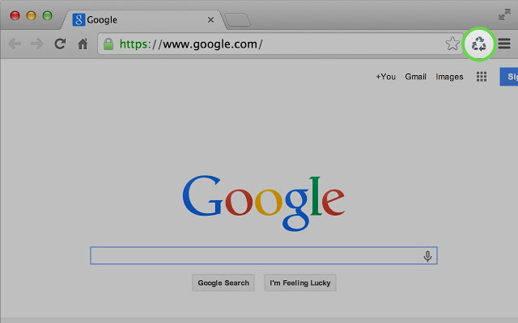

Quickly clear the cache for a single website with this extension in just one click. No confirmation dialogs, popups, or
anything else.

You can customize exactly which data to delete from the options page, including application cache, cache, cookies,
downloads, file system data, form data, history, IndexedDB, local storage, plug-in data, passwords, and WebSQL.

## [ColorPick Eyedropper](https://chrome.google.com/webstore/detail/colorpick-eyedropper/ohcpnigalekghcmgcdcenkpelffpdolg)

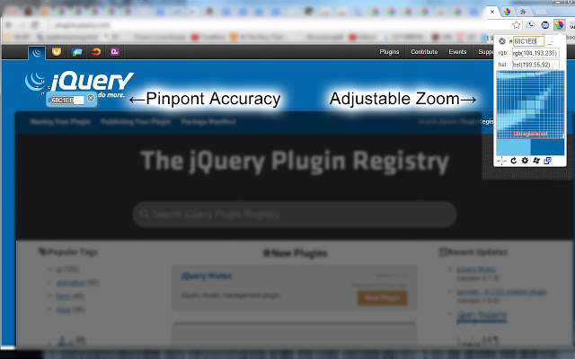

This extension lets you select a single pixel on a web page and capture its RGB color.

It is extremely useful. You can copy and paste the value instantly through a magnified preview and then use it anywhere
you like.

## [CSS3 Generator](https://chrome.google.com/webstore/detail/css3-generator/dmlgmehijaodgkkooghkknjjkddahmej)

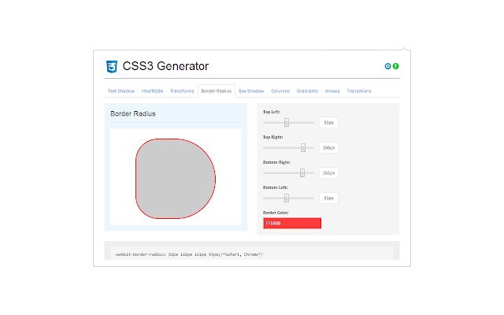

A practical CSS3 generator for all your needs, directly inside the browser.

CSS3 Generator is a handy extension that creates the code you need for your CSS. It currently generates cross-browser
code, whenever possible, for many CSS3 properties, for example:

1. Transforms
2. Border Radius
3. Box Shadow
4. Columns
5. Gradients

## [CSSViewer](https://chrome.google.com/webstore/detail/cssviewer/ggfgijbpiheegefliciemofobhmofgce)

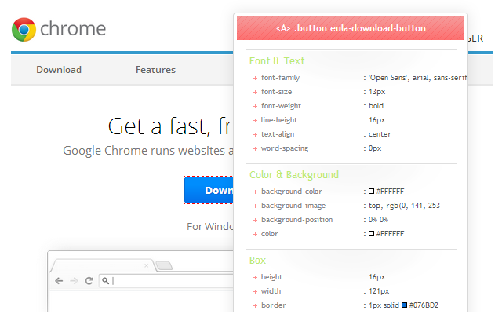

With this extension you can inspect all the CSS rules applied to a single DOM element. All the information is shown in a
popup. This tool is very useful when you need style information quickly.

## [Dimensions](https://chrome.google.com/webstore/detail/dimensions/baocaagndhipibgklemoalmkljaimfdj)

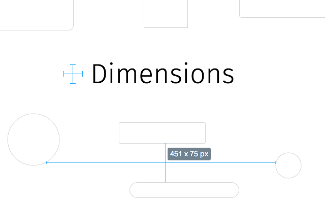

An excellent tool for designers, useful for measuring on-screen dimensions. This extension can detect distances from the
mouse pointer to the first edge found in that area.

If you want to measure the spacing between elements on a website, this is perfect. You can measure images, inputs,
buttons, videos, GIFs, text, icons, and much more.

## [Full Page Screen Capture](https://chrome.google.com/webstore/detail/full-page-screen-capture/fdpohaocaechififmbbbbbknoalclacl)

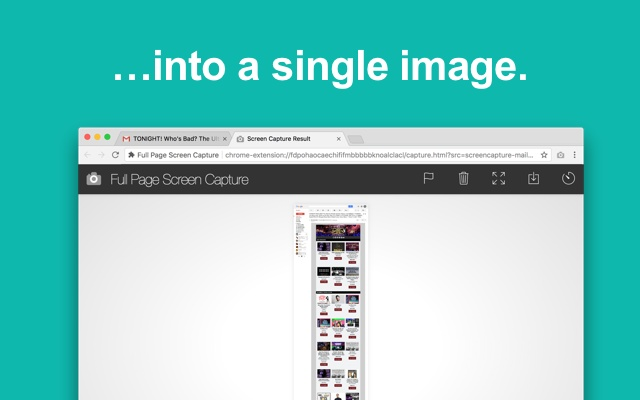

Capture a screenshot of an entire web page. Just click the extension icon, or press Alt + Shift + P, and you will be
taken to a new tab where you can download the screenshot as an image or PDF, or simply drag it onto your desktop.

## [Grid Ruler](https://chrome.google.com/webstore/detail/grid-ruler/joadogiaiabhmggdifljlpkclnpfncmj)

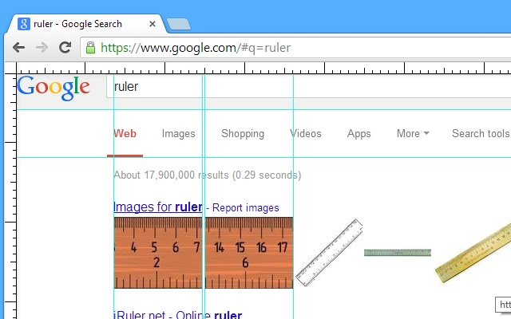

With this extension you can create grids and easily measure their spacing. It lets you build vertical and horizontal
grids in a Photoshop-like style.

A ruler is also available to measure distances precisely.

## [HTML Hierarchy Visualizer](https://chrome.google.com/webstore/detail/html-hierarchy-visualizer/beaeppehjnnnidajcmalfcajahopihcb)

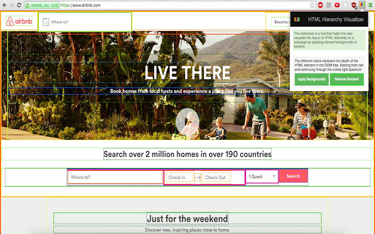

This extension is a tool that helps you visualize the layout of HTML elements on a web page.

HTML Hierarchy Visualizer is a visualization tool for front-end web developers that helps you understand the structure
and nesting of DOM elements by creating colored borders and backgrounds to distinguish them.

## [JSON Viewer](https://chrome.google.com/webstore/detail/json-viewer/gbmdgpbipfallnflgajpaliibnhdgobh)

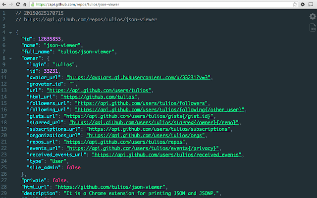

A very useful extension for viewing JSON directly in your browser. You can customize the colors and group objects to
make the document easier to read.

## [Library Detector](https://chrome.google.com/webstore/detail/library-detector/cgaocdmhkmfnkdkbnckgmpopcbpaaejo)

It detects the JavaScript libraries running on a page and shows their icons in the address bar.

Library Detector shows which JavaScript libraries are being used on a web page and also exposes a link to the library's
homepage right from the address bar.

## [Page Load Time](https://chrome.google.com/webstore/detail/page-load-time/fploionmjgeclbkemipmkogoaohcdbig)

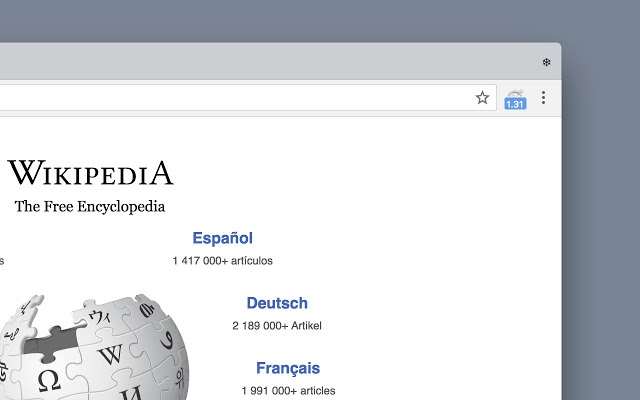

This extension measures page load time and shows it in the toolbar.

Once you click the icon after the page has loaded, you can inspect the different phases in detail, such as how long the
DOM took to be processed.

## [Performance-Analyser](https://chrome.google.com/webstore/detail/performance-analyser/djgfmlohefpomchfabngccpbaflcahjf)

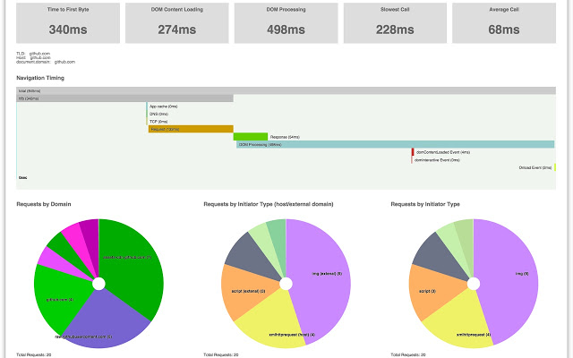

Get detailed performance information about a website. This extension is essentially a small live version of WebPageTest.

Performance-Analyser helps analyze the current page through the Resource Timing, Navigation Timing, and User Timing
APIs. You can inspect requests by type, domain, loading time, and more.

## [React Developer Tools](https://chrome.google.com/webstore/detail/react-developer-tools/fmkadmapgofadopljbjfkapdkoienihi)

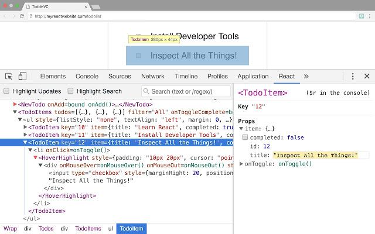

It adds React debugging tools to Chrome DevTools.

React Developer Tools is a Chrome extension for the React library. It lets you inspect component hierarchies, check
incoming props, and much more.

## [The New Tab – Customize Your Chrome Start Page](https://chrome.google.com/webstore/detail/the-new-tab-customize-you/ddjdamcnphfdljlojajeoiogkanilahc)

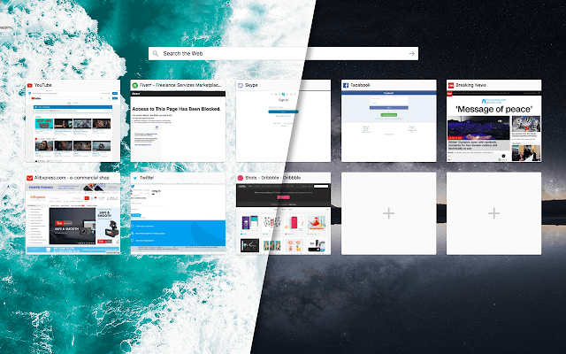

With this extension you can add all the links you want to a customized Chrome new tab.

You can decide how many links to display, change the background, and do much more. I personally use it to keep the best
IT publications on my home screen.

## [Web Maker](https://chrome.google.com/webstore/detail/web-maker/lkfkkhfhhdkiemehlpkgjeojomhpccnh)

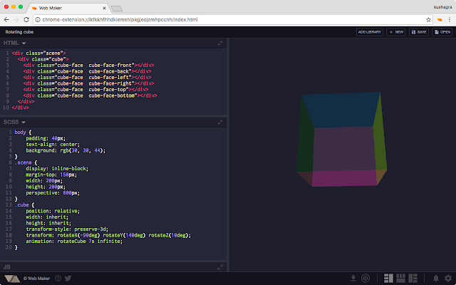

This extension gives you an accessible offline sandbox for your web experiments.

It is perfect for developers who want to experiment or practice with HTML, CSS, and JavaScript quickly, even without an
Internet connection.

## [TunnelBear VPN](https://chrome.google.com/webstore/detail/tunnelbear-vpn/omdakjcmkglenbhjadbccaookpfjihpa)

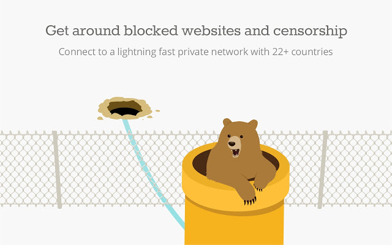

With TunnelBear you can simulate connections from other countries. It also helps reduce the chance that websites,
advertisers, and ISPs track your browsing, protect your browser on public Wi-Fi, and let you visit websites that are
blocked in specific countries.

## [Vue.js devtools](https://chrome.google.com/webstore/detail/vuejs-devtools/nhdogjmejiglipccpnnnanhbledajbpd)

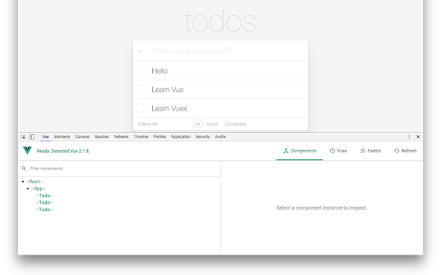

Just like React Developer Tools, Vue.js devtools helps you debug a Vue.js application. It also lets you inspect your
app's state through Vuex state management.
