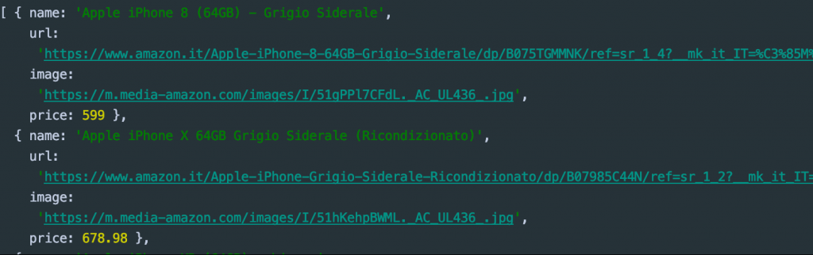

You have probably heard the phrase **"web scraping"** many times, but what exactly is it?

Web scraping, **also known as web harvesting or web data extraction**, is a technique used to extract data from a
website by means of software programs. Usually, these programs simulate human browsing on the World Wide Web by using
the Hypertext Transfer Protocol (HTTP) or a browser, such as Internet Explorer or Mozilla Firefox. _Thanks, Wikipedia._

That naturally leads to the next question: **why should I use this technique?**

When the concept of
**[RESTful](https://en.wikipedia.org/wiki/REST) [API](https://en.wikipedia.org/wiki/API)**
became widespread, most developers imagined a world of freely accessible data. Any application, such as an e-commerce
tool, would have been able to connect to an API and obtain all the data it could potentially need.

Unfortunately, many companies realized that **those data sets were far more valuable in their own hands** and not worth
sharing for free. That is why today you cannot always find an open-source API to rely on when you need one.


Suppose we want to build a web app that compares the price of an **iPhone X** across multiple e-commerce websites at
the same time, so it can immediately show the lowest one to the user. Now let's assume that **only 50% of those
platforms** offer an API that exposes their store data.

That is clearly a problem that can be solved with **web scraping**.

So we are going to see how to build a small **Node.js** app capable of fetching the
**latest five 64GB iPhone X listings on Amazon.it** thanks to a very powerful tool: **Puppeteer**.

[**Puppeteer**](https://github.com/GoogleChrome/puppeteer) is a **Node.js** library that provides a high-level API for
controlling Chrome or Chromium through DevTools ([online sandbox](https://try-puppeteer.appspot.com/)).

Among the many things it can do, you can:

1. _Generate screenshots and PDFs from web pages_
2. _Perform HTTP requests_
3. _Change the page viewport_
4. _Access DOM APIs_
5. _Run automated tests_
6. _And much more..._

Assuming you already have **Node.js** installed, if not I recommend
[watching this short video](https://www.youtube.com/watch?v=qZQmCfkmbNA), the first steps are simple:
create a folder, for example called **web-scraping**, run `npm init --yes` inside it to generate `package.json`, and
then install **Puppeteer** with `npm i puppeteer`.

Once those initial rituals are done, create a file called **app.js** in that folder and open it in your IDE.

First of all, we need to import **Puppeteer** and declare the domain we want to scrape, in this case Amazon:

```jsx
// load puppeteer
const puppeteer = require('puppeteer');
const domain = "https://www.amazon.it";
```

Then we can start defining a few initial settings:

```jsx
// IIFE
(async () => {
  // wrapper to catch errors
  try {
    // create a new browser instance
    const browser = await puppeteer.launch();

    // create a page inside the browser;
    const page = await browser.newPage();

    // navigate to a website and set the viewport
    await page.setViewport({ width: 1280, height: 800 });
    await page.goto(domain, {
      timeout: 3000000
    });
    
  } catch (error) {
    // display errors
    console.log(error)
  }
})();
```

The main function is an asynchronous
**IIFE** [(Immediately Invoked Function Expression)](https://developer.mozilla.org/en-US/docs/Glossary/IIFE)
that executes the JavaScript code immediately. All **Puppeteer** methods return
[**Promises**](https://developer.mozilla.org/en-US/docs/Web/JavaScript/Reference/Global_Objects/Promise), so for
convenience we will use [async/await](https://javascript.info/async-await) instead of chaining `.then()` calls and keep
the code cleaner.

Let's quickly look at what the lines in the snippet are doing:

1. `await puppeteer.launch();` creates a new browser instance
2. `await browser.newPage();` creates a page inside Chrome
3. `page.setViewport({ width: 1280, height: 800 });` defines the window size, while `await page.goto(domain, { timeout: 3000000 });` performs the HTTP request and reaches the domain we defined earlier.

You will also notice that a `timeout` was defined. This is used to override Puppeteer's default timeout for HTTP
requests, because some domains may take longer to respond.

As mentioned earlier, **Puppeteer** can interact with the DOM, and this feature is essential if you want to simulate
browsing inside a browser.

Now we will perform a real search directly from the **Amazon.it** input field and wait for the store results. As the
cherry on top, we will also generate a **.png** screenshot of the page.

```jsx
// search and wait for the product list
await page.type('#twotabsearchtextbox', 'iphone x 64gb');
await page.click('input.nav-input');
await page.waitForSelector('.s-image');

// take a screenshot
await page.screenshot({path: 'search-iphone-x.png'});
```

The screenshot will be saved in the root of your project and it is exactly what **Puppeteer** is rendering:


Another very important thing to focus on is `waitForSelector`, which waits until a specific DOM node has been rendered
in the client. Without it, the page could be incomplete. In our case I chose `.s-image`, the CSS class assigned to the
product images.

**The last step is DOM parsing.** The goal is to extract the name, product URL, image URL, and price from each iPhone.

To do that, we need to use the `evaluate()` method.

```jsx
const products = await page.evaluate(() => {
  const links = Array.from(document.querySelectorAll('.s-result-item'));
  return links.map(link => {
    if (link.querySelector(".a-price-whole")) {
      return {
        name: link.querySelector(".a-size-medium.a-color-base.a-text-normal").textContent,
        url: link.querySelector(".a-link-normal.a-text-normal").href,
        image: link.querySelector(".s-image").src,
        price: parseFloat(link.querySelector(".a-price-whole").textContent.replace(/[,.]/g, m => (m === ',' ? '.' : ''))),
      };
    }
  }).slice(0, 5);
});

console.log(products.sort((a, b) => {
  return a.price - b.price;
}));

await browser.close();
```

At the beginning we need to find all the nodes that contain products. In this case we use the `.s-result-item` class and
with `querySelectorAll` we obtain a `NodeList`, which must then be converted into an array. At that point it is enough
to **iterate** over it, access each node reference, select the inner elements, and return an object.

Finally, we simply use `sort` to order the products by price and then close the browser that **Puppeteer** opened.

_Output:_



Obviously, Amazon's search engine also returned an **iPhone 8**. At that point it is up to you to filter the different
products with ad hoc rules.

This is only one of the many things you can do with **Node.js** and **Puppeteer**.

Pretty amazing, isn't it? We have effectively created something that looks like a small crawler. Many companies use
these techniques to compare products, travel options, and much more.

Below is the complete source code, which you can run from the project root with `node app.js`:

```jsx
// load puppeteer
const puppeteer = require('puppeteer');
const domain = "https://www.amazon.it";

// IIFE
(async () => {
  // wrapper to catch errors
  try {
    // create a new browser instance
    const browser = await puppeteer.launch();

    // create a page inside the browser;
    const page = await browser.newPage();

    // navigate to a website and set the viewport
    await page.setViewport({ width: 1280, height: 800 });
    await page.goto(domain, {
      timeout: 3000000
    });

    // search and wait for the product list
    await page.type('#twotabsearchtextbox', 'iphone x 64gb');
    await page.click('input.nav-input');
    await page.waitForSelector('.s-image');

    // take a screenshot
    await page.screenshot({path: 'search-iphone-x.png'});

    const products = await page.evaluate(() => {
      const links = Array.from(document.querySelectorAll('.s-result-item'));
      return links.map(link => {
        if (link.querySelector(".a-price-whole")) {
          return {
            name: link.querySelector(".a-size-medium.a-color-base.a-text-normal").textContent,
            url: link.querySelector(".a-link-normal.a-text-normal").href,
            image: link.querySelector(".s-image").src,
            price: parseFloat(link.querySelector(".a-price-whole").textContent.replace(/[,.]/g, m => (m === ',' ? '.' : ''))),
          };
        }
      }).slice(0, 5);
    });

    console.log(products.sort((a, b) => {
      return a.price - b.price;
    }));

    // close the browser
    await browser.close();
  } catch (error) {
    // display errors
    console.log(error)
  }
})();
```
