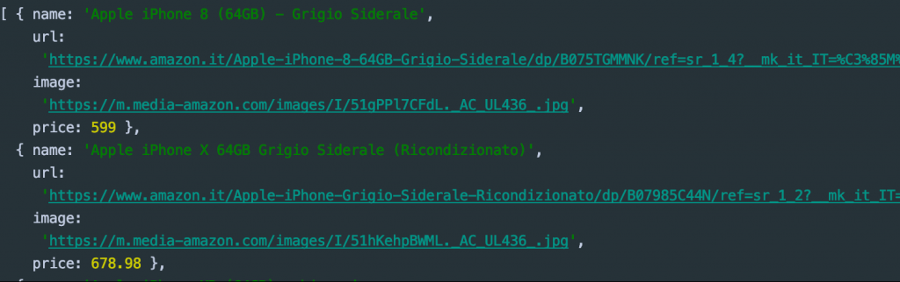

Probabilmente avrai sentito spesso la parola **“Web Scraping”**, ma esattamente di cosa si tratta?

Il web scraping **(detto anche web harvesting o web data extraction)** è una tecnica informatica di estrazione di dati
da un sito web per mezzo di programmi software. Di solito, tali programmi simulano la navigazione umana nel World Wide
Web utilizzando l’Hypertext Transfer Protocol (HTTP) o attraverso browser, come Internet Explorer o Mozilla Firefox. _– Grazie Wikipedia._

Ora viene spontanea la seconda domanda, **perché dovrei utilizzare questa tecnica?**

Quando il concetto
di **[RESTful](https://it.wikipedia.org/wiki/Representational_State_Transfer) [API](https://it.wikipedia.org/wiki/Application_programming_interface)**
è stato concretizzato, la maggior parte degli sviluppatori immaginava un mondo fatto di dati accessibili liberamente.
Qualsiasi applicazione avrebbe potuto connettersi appunto ad una API (e-commerce e simili) per ottenere tutti i dati di
cui si avrebbe avuto potenzialmente bisogno.

Sfortunatamente però, molte società hanno realizzato che **i suddetti dati avevano molto più valore nelle loro mani** e non valeva 
la pena divulgarli gratuitamente. Ragione per cui oggi non troviamo sempre un API Open Source da cui attingere in caso di necessità.


Supponiamo di voler creare una Web App che paragona il prezzo di un **iPhone X** da diversi e-commerce simultaneamente,
così da fornire immediatamente il più basso all’utente. Ipotizziamo inoltre che **solo il 50% di queste piattaforme**
offra un API per ottenere i dati dal loro store.

Questo è chiaramente un problema risolvibile con **Web Scraping.**

Vedremo quindi come sviluppare una piccola App in **Node JS** in grado di prelevare gli 
**ultimi 5 iPhone X da 64GB su Amazon.it** grazie ad un tool molto potente: **Puppeteer.**

[**Puppeteer**](https://github.com/GoogleChrome/puppeteer) è una libreria di **Node JS** che fornisce un’API di alto
livello per controllare Chrome o Chromium tramite il DevTools ([sandbox online](https://try-puppeteer.appspot.com/)).

Tra le varie operazioni è possibile:

1. _Generare screenshots e PDF da pagine web_
2. _Effettuare chiamate HTTP_
3. _Modificare il Viewport della pagina_
4. _Accedere alle API del DOM_
5. _Eseguire test automatici_
6. _e tanto altro…_

Assumendo che tu abbia **Node JS** già installato (se non è così ti consiglio
di [guardare questo breve video](https://www.youtube.com/watch?v=qZQmCfkmbNA)), le prime operazioni da compiere sono:
creare una cartella (ad esempio chiamata **web-scraping**) ed eseguire il comando da terminare all’interno di
essa `npm init --yes` (per generare il package.json) e installare **Puppeteer** tramite `npm i puppeteer`.

Al termine di queste cerimonie iniziali creiamo un file chiamato **app.js** nella nostra cartella ed apriamolo con il
nostro IDE.

Prima di tutto è necessario importare **Puppeteer** e dichiarare il dominio su cui vogliamo eseguire lo **Scraping,** in
questo caso Amazon:

```jsx
// load puppeteer
const puppeteer = require('puppeteer');
const domain = "https://www.amazon.it";
```

Poi possiamo iniziare a definire alcune configurazioni iniziali:

```jsx
// IIFE
(async () => {
  // wrapper to catch errors
  try {
    // create a new browser instance
    const browser = await puppeteer.launch();

    // create a page inside the browser;
    const page = await browser.newPage();

    // navigate to a website and set the viewport
    await page.setViewport({ width: 1280, height: 800 });
    await page.goto(domain, {
      timeout: 3000000
    });
    
  } catch (error) {
    // display errors
    console.log(error)
  }
})();
```

La funzione principale è una **IIFE** [(Immediately Invoked Function Expression)](https://developer.mozilla.org/en-US/docs/Glossary/IIFE) asincrona che
eseguirà immediatamente il codice JavaScript. Tutti i metodi di **Puppeteer** restituiscono 
[**Promises**](https://developer.mozilla.org/it/docs/Web/JavaScript/Reference/Global_Objects/Promise), quindi per comodità
utilizzeremo [Async/await](https://javascript.info/async-await) anziché i vari `.then()` per mantenere il codice più pulito.

Vediamo però nel le righe di codice dello snippet:

1. `await puppeteer.launch();` crea una nuova istanza del browser
2. `await browser.newPage();` crea una pagina all’interno di chrome
3. mentre `page.setViewport({ width: 1280, height: 800 });` definisce la dimensione della finestra e `await page.goto(domain, { timeout: 3000000 });` esegue la chiamata HTTP e raggiunge il dominio definito precedentemente.

Noterete inoltre che è stato definito un `timeout`. Questa operazione serve a modificare il normale timeout di **Puppeteer**
per le richieste HTTP (può succedere che un dominio impieghi diverso tempo per rispondere).

Come anticipato precedentemente, **Puppeteer** è in grado di interagire con il DOM, infatti questa feature è
fondamentale per simulare la navigazione all’interno del browser.

Ora proveremo ad effettuare una vera ricerca direttamente dall’input di **Amazon.it** e attenderemo i risultati dello
store. Come ciliegina sulla torta genereremo anche uno screenshot della pagina in formato **.png**.

```jsx
// search and wait the product list
await page.type('#twotabsearchtextbox', 'iphone x 64gb');
await page.click('input.nav-input');
await page.waitForSelector('.s-image');

// create a screenshots
await page.screenshot({path: 'search-iphone-x.png'});
```

Lo screen verrà salvato nella root del vostro progetto ed è di fatto ciò che sta visualizzando **Puppeteer**:


Un altro aspetto molto importante su cui soffermarsi è il `waitForSelector`, serve ad attendere che un particolare nodo
del DOM venga renderizzato nel client. Senza di esso la pagina potrebbe essere incompleta. Nel nostro caso ho
scelto `.s-image`, ovvero la classe CSS assegnata alle immagini dei prodotti.

**L’ultimo step è il parsing del DOM, lo scopo è quello di prendere: nome, url del prodotto, url dell’immagine e il
prezzo da ogni iPhone.**

Per farlo è necessario utilizzare il metodo `evaluate()`.

```jsx
const products = await page.evaluate(() => {
  const links = Array.from(document.querySelectorAll('.s-result-item'));
  return links.map(link => {
    if (link.querySelector(".a-price-whole")) {
      return {
        name: link.querySelector(".a-size-medium.a-color-base.a-text-normal").textContent,
        url: link.querySelector(".a-link-normal.a-text-normal").href,
        image: link.querySelector(".s-image").src,
        price: parseFloat(link.querySelector(".a-price-whole").textContent.replace(/[,.]/g, m => (m === ',' ? '.' : ''))),
      };
    }
  }).slice(0, 5);
});

console.log(products.sort((a, b) => {
  return a.price - b.price;
}));

await browser.close();
```

All’inizio dobbiamo trovare tutti i nodi che contengono i prodotti, in questo caso utilizzeremo la
classe `.s-result-item` e grazie a `querySelectorAll` otterremo un NodeList, che dovrà essere convertita in un Array. A
quel punto sarà sufficiente **iterare** e accedere alla reference del nodo per selezionare tutti gli elementi interni ad
essa e restituire un oggetto.

Infine, dovremo semplicemente utilizzare un `sort` per ordinare i prodotti per prezzo e chiudere il browser
precedentemente aperto da **Puppeteer.**

_Output:_



Chiaramente, il motore di ricerca di Amazon ha restituito anche un **iPhone 8,** qui starà a voi discriminare i vari
prodotti con regole ad hoc.

Questo è solo una delle tantissime operazioni possibili grazie a **Node JS** e **Puppeteer.**

Incredibile non è vero? Abbiamo di fatto creato qualcosa che assomiglia ad un piccolo crawler. Molte società utilizzano
queste tecniche per paragonare prodotti, viaggi e tanto altro.

Di seguito il c_odice sorgente completo_ eseguibile tramite il comando `node app.js` dalla root principale:

```jsx
// load puppeteer
const puppeteer = require('puppeteer');
const domain = "https://www.amazon.it";

// IIFE
(async () => {
  // wrapper to catch errors
  try {
    // create a new browser instance
    const browser = await puppeteer.launch();

    // create a page inside the browser;
    const page = await browser.newPage();

    // navigate to a website and set the viewport
    await page.setViewport({ width: 1280, height: 800 });
    await page.goto(domain, {
      timeout: 3000000
    });

    // search and wait the product list
    await page.type('#twotabsearchtextbox', 'iphone x 64gb');
    await page.click('input.nav-input');
    await page.waitForSelector('.s-image');

    // create a screenshots
    await page.screenshot({path: 'search-iphone-x.png'});

    const products = await page.evaluate(() => {
      const links = Array.from(document.querySelectorAll('.s-result-item'));
      return links.map(link => {
        if (link.querySelector(".a-price-whole")) {
          return {
            name: link.querySelector(".a-size-medium.a-color-base.a-text-normal").textContent,
            url: link.querySelector(".a-link-normal.a-text-normal").href,
            image: link.querySelector(".s-image").src,
            price: parseFloat(link.querySelector(".a-price-whole").textContent.replace(/[,.]/g, m => (m === ',' ? '.' : ''))),
          };
        }
      }).slice(0, 5);
    });

    console.log(products.sort((a, b) => {
      return a.price - b.price;
    }));

    // close the browser
    await browser.close();
  } catch (error) {
    // display errors
    console.log(error)
  }
})();
```
