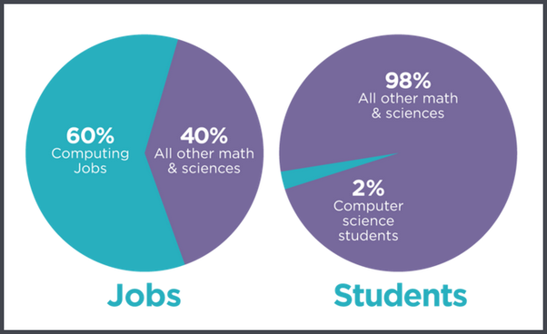
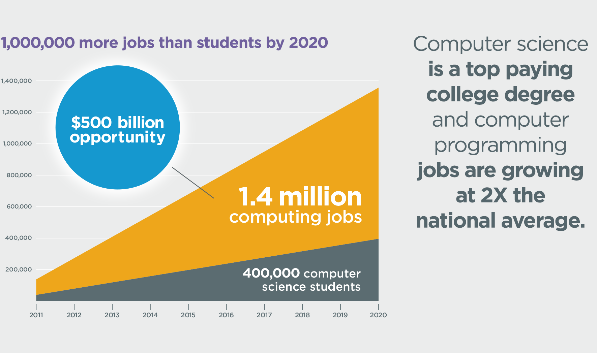
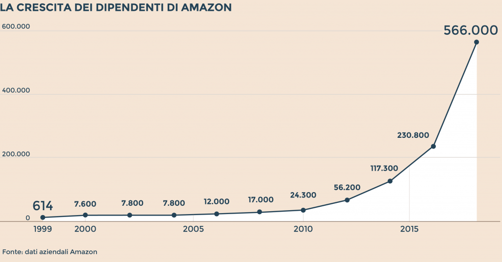
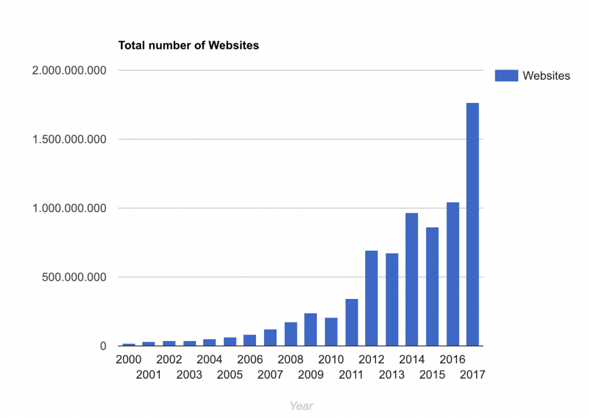

The first time I decided to get closer to the IT world, I was 17 years old. **It was 2010** and, to give you an idea
of how quickly time moves, **on July 27 of that same year** Apple launched the **iPhone 4** and on **October 6**
**Instagram** arrived.

The concept of **"Mobile First"** still felt fairly abstract. **Amazon** had only 24,000 employees, **Netflix** was
not yet part of our everyday thinking, and surely none of us imagined that technology could have such a broad impact on
our daily lives.

What happened in those nine years? **A gigantic explosion of opportunity created a new world that not even the most
visionary people had predicted.**

In 2010 it all seemed like a game. Relatives and friends still saw the IT industry as something "mysterious" and
"opaque". I still remember the question: **are you sure companies are looking for profiles like yours?**

We all know it: Italy is certainly a beautiful country, but unfortunately some ideas take a long time to settle in. The
word programmer was always associated with the idea of a **"computer tinkerer"**, and I am still not sure that even
today the meaning of the word **Design** is fully understood.

For many people, **the programmer has always been associated with the nerd stereotype**, some dark figure locked in a
basement with an old CRT monitor. **An elusive character**, mysterious and misunderstood, surrounded by the idea of
doing nothing useful.

Today, however, **in 2019 the situation is different.** People are changing the way they see things, and programmers
are changing too.

Today the programmer is cool and fashionable. **A tormented artist.** No more bulky CRT monitor: now there is a
latest-generation MacBook Pro, ultra-thin and super light. No more basement either: now they work on the 19th floor of
a large software company.

The modern programmer is in high demand and, if they are good, they are paid very well. And they are perfectly aware of
all of this.

**Today the IT sector is the market with the highest demand overall.** And how large is the supply? Right now only 2%
of students choose this path, but IT represents 60% of the currently available STEM-related jobs
(Science, Technology, Engineering, Math).

According to estimates, **by 2020 there will be about one million more job openings** than the number of graduates in
this field.

From these statistics we can draw **two possible conclusions:**

1. You do not need a degree to work in IT, considering how much information is available online, and here I recommend the now famous article: [You Don’t Need a College Degree to be a Software Developer!](https://programmingwithmosh.com/general/dont-need-college-degree/)
2. Given the strong demand and limited supply, salaries will be higher and the chances of building a successful career in this field will naturally be greater.

**By now it is as clear as daylight:** the whole world is converging toward technology. Think about what people do every
day: they constantly connect to the Internet from all kinds of devices, use applications, watch streaming content, share
photos and feelings on social media, manage smart-home systems from an app, pay with their smartphone, and much more.

Take big companies such as **Amazon, Apple, Netflix, and Airbnb**. They keep growing. They create new jobs and therefore
new opportunities. In just a few years, possible careers in IT have grown exponentially. We now find roles that barely
existed before, such as:

_Cloud Architect, IT Director, Senior System Designer, Front End Developer, Data Center Support Specialist, Senior
Network Architect **and many more!** For the full list, I recommend reading
[List of Information Technology (IT) Job Titles](https://www.thebalancecareers.com/list-of-information-technology-it-job-titles-2061498)._

**We live in extraordinary times.** Every day, when I read IT news, someone somewhere in the world has invented
something new. This sector is growing faster than the companies that finance it.

Amazon had about 24,000 employees in 2010. **Today:**

**Impressive numbers, aren't they?**

The box is open now. This is a train moving at an incalculable speed. But know this: you can still get on board, and
the moment is now.

Every day I see people who start studying from scratch with the goal of becoming a **Front-end Developer** or **UX
Developer**, for example, and then leave their old job behind.

A new digital era has begun and the world is reacting. Look at the number of websites from 2000 until today:

**One day, the best programmers will be the rockstars of modern society and they will have highly prestigious salaries
and roles.** Computer science will dominate the whole world.

Everything will be digitized; it is only a matter of time. **It is very important, however, to stay connected to
reality.** We need to know how to preserve ourselves in this great computing age. That is why I recommend reading my
article: [Survival Kit for Web Developers](/survival-kit-for-web-developers/).
